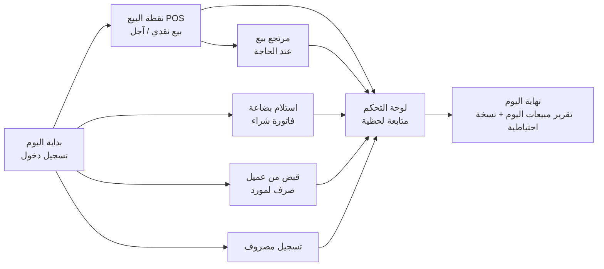
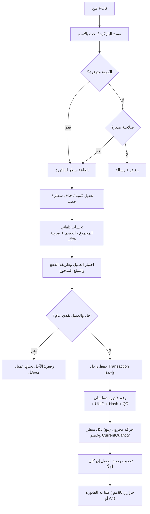
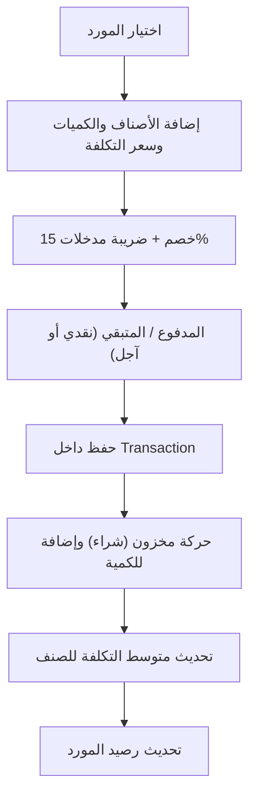
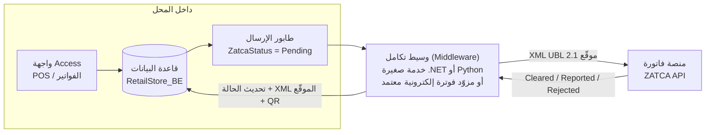
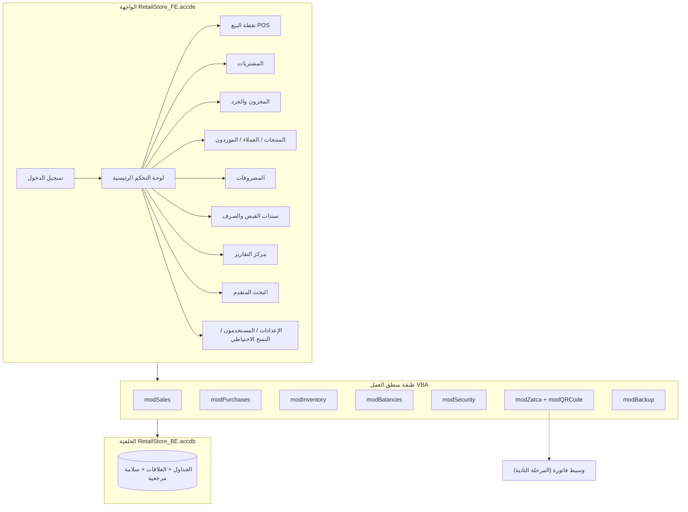
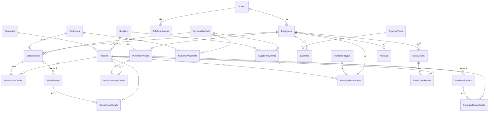

# المرحلة 1: تحليل النظام
## Retail Store Management System – Microsoft Access (مع متطلبات الفوترة الإلكترونية في السعودية)

> الحالة: **مكتملة وبانتظار موافقتك** قبل الانتقال إلى المرحلة 2 (تصميم الجداول).

---

## 0. طريقة البناء والتسليم

لا يمكن إنشاء ملف `.accdb` كامل (بنماذجه وتقاريره وكود VBA) خارج برنامج Access نفسه، لذلك سيُسلَّم النظام على شكل **ملفات مصدرية نصية** محفوظة في هذا المستودع، تبني قاعدة البيانات داخل Access بضغطة زر:

| المكوّن | الشكل | طريقة التشغيل |
|---|---|---|
| الجداول والفهارس والعلاقات | وحدة VBA `modBuildSchema.bas` (DDL + DAO) | تستورد الوحدة في قاعدة فارغة ثم تشغّل `BuildSchema` |
| الاستعلامات | ملفات `.sql` ووحدة `modBuildQueries.bas` | `BuildQueries` |
| البيانات التجريبية | `modSeedData.bas` | `SeedDemoData` |
| منطق العمل (البيع، الشراء، المخزون، الأرصدة) | وحدات VBA مستقلة عن النماذج | تُستدعى من النماذج |
| النماذج والتقارير | وحدات VBA تنشئها برمجيًا + كود الأحداث | `BuildForms` / `BuildReports` |
| ضريبة القيمة المضافة وQR (فاتورة – المرحلة الأولى) | `modZatca.bas` + مولّد QR بلغة VBA | تلقائيًا عند حفظ الفاتورة |

**البنية المقترحة: قاعدة مقسومة (Split Database)**

- `RetailStore_BE.accdb` (الخلفية): الجداول والبيانات فقط.
- `RetailStore_FE.accde` (الواجهة): النماذج والتقارير والاستعلامات والكود، مرتبطة بالجداول.

الفائدة: تحديث الواجهة دون المساس بالبيانات، دعم أكثر من جهاز كاشير على الشبكة، نسخ احتياطي أسهل، وحماية الكود بصيغة `.accde`.

---

## 1. الكيانات الرئيسية

| # | الكيان | الجدول | الوصف |
|---|---|---|---|
| 1 | إعدادات المحل | `Settings` | اسم المحل، الرقم الضريبي، السجل التجاري، العنوان، نسبة الضريبة، السماح بالبيع بالسالب، عدّادات الترقيم |
| 2 | التصنيفات | `Categories` | تصنيف المنتجات |
| 3 | المنتجات | `Products` | بيانات الصنف وسعره وكميته الحالية |
| 4 | الموردون | `Suppliers` | الموردون وأرصدتهم |
| 5 | العملاء | `Customers` | العملاء (نقدي/آجل) وأرصدتهم |
| 6 | الموظفون/المستخدمون | `Employees` | الدخول والصلاحيات |
| 7 | الصلاحيات | `Roles` / `RolePermissions` | Administrator / Manager / Cashier |
| 8 | فواتير المبيعات | `SalesInvoices` + `SalesInvoiceDetails` | رأس وتفاصيل |
| 9 | **مرتجعات المبيعات** | `SalesReturns` + `SalesReturnDetails` | إشعار دائن (Credit Note) مربوط بالفاتورة الأصلية |
| 10 | فواتير المشتريات | `PurchaseInvoices` + `PurchaseInvoiceDetails` | رأس وتفاصيل |
| 11 | **مرتجعات المشتريات** | `PurchaseReturns` + `PurchaseReturnDetails` | مرتبطة بفاتورة الشراء |
| 12 | دفعات العملاء | `CustomerPayments` | سندات قبض |
| 13 | دفعات الموردين | `SupplierPayments` | سندات صرف |
| 14 | المصروفات | `Expenses` + `ExpenseTypes` | المصروف ونوعه |
| 15 | حركة المخزون | `InventoryTransactions` | **دفتر الأستاذ للمخزون** – مصدر الحقيقة للكميات |
| 16 | **الجرد** | `StockCounts` + `StockCountDetails` | جلسة جرد وتفاصيل الفروقات |
| 17 | جداول مرجعية | `PaymentMethods`, `TransactionTypes`, `Units` | قوائم ثابتة للاختيار |
| 18 | **سجل العمليات** | `AuditLog` | من فعل ماذا ومتى (دخول، حذف، تعديل سعر، بيع بالسالب) |

> الكيانات المكتوبة **بالخط العريض** غير موجودة في قائمة الجداول الأصلية وأقترح إضافتها (التفصيل في القسم 13).

---

## 2. العمليات اليومية داخل المحل



| الدور | العمليات اليومية |
|---|---|
| الكاشير | فتح POS، بيع، اختيار عميل، طباعة الفاتورة، تسجيل قبض من عميل |
| المدير | المشتريات، المرتجعات، الجرد، المصروفات، التقارير، تعديل الأسعار |
| مدير النظام | المستخدمون والصلاحيات، الإعدادات، النسخ الاحتياطي، السماح بالبيع بالسالب |

---

## 3. دورة البيع



**قواعد أساسية:**

1. الحفظ يتم داخل **معاملة واحدة** (`BeginTrans / CommitTrans`): إما أن تُحفظ الفاتورة وتفاصيلها وحركات المخزون كلها، أو لا يُحفظ شيء.
2. **لا تُحذف فاتورة بعد حفظها**؛ التصحيح يكون بمرتجع (إشعار دائن). هذا شرط في نظام فاتورة، ويحمي من التلاعب.
3. سعر التكلفة لحظة البيع يُحفظ في سطر الفاتورة (`UnitCost`) لحساب الربح بدقة حتى لو تغيّر سعر الشراء لاحقًا.
4. البيع الآجل لا يُسمح به إلا لعميل مسجّل (ليس "عميل نقدي").

---

## 4. دورة الشراء



- رقم فاتورة المورد (`SupplierInvoiceNo`) يُحفظ إلى جانب الرقم الداخلي، ويُمنع تكراره لنفس المورد.
- ضريبة المشتريات (ضريبة المدخلات) تُحفظ منفصلة ليظهر في التقرير **صافي الضريبة المستحقة = ضريبة المخرجات − ضريبة المدخلات** (مفيد لإقرار الهيئة).

---

## 5. حركة المخزون

**المبدأ:** جدول `InventoryTransactions` هو **السجل الأساسي**، و`Products.CurrentQuantity` قيمة مُخزَّنة للسرعة فقط تُحدَّث في نفس المعاملة، مع أداة "إعادة احتساب الأرصدة" للتأكد من التطابق.

| نوع الحركة | الإشارة | المصدر |
|---|---|---|
| شراء | + | فاتورة شراء |
| بيع | − | فاتورة بيع |
| مرتجع شراء | − | مرتجع شراء |
| مرتجع بيع | + | مرتجع بيع |
| إضافة مخزون | + | يدوي (مدير) |
| خصم مخزون (تالف/هدايا) | − | يدوي (مدير) |
| تسوية جرد | ± | جلسة جرد |
| رصيد افتتاحي | + | عند إدخال الصنف أول مرة |

- الكمية في الجدول تُخزَّن **بإشارتها** (موجبة أو سالبة)، فيصبح رصيد أي صنف = `SUM(Quantity)` ببساطة.
- كل حركة تحمل `ReferenceType` و`ReferenceID` للرجوع إلى المستند الذي أنشأها.

**طريقة احتساب التكلفة: المتوسط المرجّح (Weighted Average)**

```
متوسط التكلفة الجديد = (الكمية الحالية × متوسط التكلفة الحالي + الكمية المشتراة × تكلفة الشراء)
                        ÷ (الكمية الحالية + الكمية المشتراة)
```

هي الأنسب لمحل تجزئة في Access (أبسط وأدق عمليًا من FIFO الذي يحتاج تتبّع دفعات).

---

## 6. إدارة العملاء والديون

```
رصيد العميل = الرصيد الافتتاحي
            + مجموع المتبقي من فواتير البيع الآجلة
            − مجموع دفعات العميل (سندات القبض)
            − قيمة المرتجعات غير المستردّة نقدًا
```

- رصيد موجب = العميل مدين للمحل.
- يوجد سجل ثابت باسم **"عميل نقدي"** (CustomerID = 1) يُستخدم افتراضيًا في المبيعات النقدية.
- حد ائتمان اختياري `CreditLimit` يمنع البيع الآجل إذا تجاوز العميل حدّه (يمكن للمدير تجاوزه).
- كشف حساب العميل: كل الحركات مرتبة زمنيًا مع رصيد تراكمي.

## 7. إدارة الموردين

```
رصيد المورد = الرصيد الافتتاحي
            + مجموع المتبقي من فواتير الشراء
            − مجموع الدفعات للمورد
            − قيمة مرتجعات الشراء غير المستردّة نقدًا
```

رصيد موجب = المحل مدين للمورد.

---

## 8. المصروفات

- جدول أنواع المصروفات `ExpenseTypes` (إيجار، كهرباء، مياه، إنترنت، نقل، صيانة، رواتب، مستلزمات، أخرى) بدل نص حر، لتكون التقارير المجمّعة دقيقة.
- لكل مصروف: التاريخ، النوع، المبلغ، ضريبة المدخلات (إن وجدت فاتورة ضريبية)، الوصف، الموظف، طريقة الدفع.

## 9. الأرباح والخسائر

```
صافي المبيعات        = مبيعات (بدون ضريبة) − المرتجعات (بدون ضريبة)
تكلفة البضاعة المباعة = Σ (الكمية × UnitCost المحفوظ في السطر) − تكلفة المرتجعات
مجمل الربح           = صافي المبيعات − تكلفة البضاعة المباعة
صافي الربح           = مجمل الربح − المصروفات (بدون ضريبة)
```

- **الضريبة ليست إيرادًا ولا مصروفًا**؛ تُستبعد من حساب الربح لأنها أمانة للهيئة.
- فروقات الجرد (عجز/زيادة) تظهر بندًا مستقلًا في تقرير الأرباح.
- كل ذلك قابل للتصفية بفترة زمنية (من تاريخ – إلى تاريخ).

---

## 10. التقارير المطلوبة

| # | التقرير | الاستعلام الأساسي | المعاملات |
|---|---|---|---|
| 1 | المبيعات اليومية | `DailySalesQuery` | التاريخ |
| 2 | المبيعات الشهرية | `MonthlySalesQuery` | السنة |
| 3 | المبيعات حسب فترة | `SalesByPeriodQuery` | من/إلى |
| 4 | المبيعات حسب منتج | `SalesByProductQuery` | المنتج، الفترة |
| 5 | أفضل المنتجات مبيعًا | `BestSellingProductsQuery` | الفترة، العدد |
| 6 | أقل المنتجات مبيعًا | `LeastSellingProductsQuery` | الفترة |
| 7 | المشتريات | `PurchasesQuery` | الفترة، المورد |
| 8 | المخزون الحالي (كمية وقيمة) | `StockBalanceQuery` | — |
| 9 | المنتجات منخفضة المخزون | `LowStockQuery` | — |
| 10 | حركة منتج | `ProductMovementQuery` | المنتج، الفترة |
| 11 | كشف حساب عميل | `CustomerStatementQuery` | العميل، الفترة |
| 12 | كشف حساب مورد | `SupplierStatementQuery` | المورد، الفترة |
| 13 | المصروفات | `ExpensesQuery` | الفترة، النوع |
| 14 | الأرباح | `ProfitQuery` | الفترة |
| 15 | المنتجات غير المتحركة | `SlowMovingProductsQuery` | عدد الأيام |
| 16 | المخزون حسب التصنيف | `StockByCategoryQuery` | — |
| 17 | **ملخص ضريبة القيمة المضافة** (إضافي) | `VatSummaryQuery` | الفترة (ربع سنوي) |
| 18 | **فاتورة البيع (حراري + A4) مع QR** | `InvoicePrintQuery` | رقم الفاتورة |

---

## 11. متطلبات المملكة العربية السعودية (ضريبة القيمة المضافة + فاتورة)

### 11.1 ما يلزم المحل المسجّل في الضريبة على كل فاتورة

| العنصر | التنفيذ في النظام |
|---|---|
| عنوان "فاتورة ضريبية مبسطة" (للأفراد B2C) أو "فاتورة ضريبية" (للمنشآت B2B) | يُحدَّد تلقائيًا: إذا كان للعميل رقم ضريبي → فاتورة ضريبية، وإلا → مبسطة |
| اسم البائع ورقمه الضريبي (15 رقمًا يبدأ وينتهي بـ 3) | من جدول `Settings` مع تحقق من صحة الصيغة |
| رقم فاتورة تسلسلي فريد | عدّاد في `Settings` يُزاد داخل المعاملة، بدون فجوات |
| تاريخ ووقت الإصدار | `InvoiceDateTime` |
| المبلغ قبل الضريبة، **الضريبة 15% منفصلة**، الإجمالي شامل الضريبة | حقول منفصلة في الرأس والسطر |
| للفاتورة الضريبية B2B: اسم المشتري، عنوانه، رقمه الضريبي، تفاصيل الأسطر بالضريبة | حقول إضافية في `Customers` |
| **رمز QR** | انظر 11.2 |
| المرتجع = **إشعار دائن** يشير لرقم الفاتورة الأصلية وسبب الإرجاع | جدول `SalesReturns` |

**الأسعار شاملة أم غير شاملة الضريبة؟** في التجزئة بالسعودية يُعرض السعر على الرف غالبًا **شاملًا الضريبة**. سيدعم النظام الخيارين عبر إعداد `PricesIncludeVAT`، والضريبة تُحسب **لكل سطر** ثم تُجمع، مع التقريب لهللتين.

### 11.2 المرحلة الأولى من فاتورة (الإصدار) – **ينفّذها Access بالكامل**

رمز QR في المرحلة الأولى عبارة عن نص بترميز **TLV** ثم **Base64** يحتوي على 5 حقول:

| Tag | المحتوى |
|---|---|
| 1 | اسم البائع |
| 2 | الرقم الضريبي للبائع |
| 3 | التاريخ والوقت بصيغة ISO 8601 (مثل `2026-10-03T14:25:00Z`) |
| 4 | إجمالي الفاتورة شامل الضريبة |
| 5 | إجمالي الضريبة |

- إنشاء نص TLV/Base64: دالة VBA (يجب ترميز النص العربي **UTF-8** وحساب الطول بالبايت لا بالحروف – خطأ شائع).
- تحويل النص إلى صورة QR: **مولّد QR مكتوب بـ VBA خالص** يرسم الصورة في التقرير، بدون أي ActiveX أو إنترنت (الحل الأضمن على Access 32/64-bit). البديل: Microsoft BarCode Control، لكنه غير مستقر على النسخ الحديثة 64-bit فلا أعتمد عليه.

### 11.3 المرحلة الثانية من فاتورة (الربط والتكامل) – **يحتاج ربط API خارجي**

عند وصول موجة الربط للمنشأة، كل فاتورة يجب أن:

1. تُولَّد بصيغة **XML (UBL 2.1)** حسب مواصفات الهيئة.
2. تُحسب لها **بصمة SHA-256** وتُربط بالفاتورة السابقة (`PreviousInvoiceHash` – سلسلة لا تنقطع) مع عدّاد `ICV`.
3. تُوقَّع رقميًا (**XAdES مع ECDSA secp256k1**) بشهادة الختم التشفيري (CSID) الصادرة من الهيئة بعد تسجيل الجهاز (Onboarding).
4. تُرسل إلى منصة فاتورة:
   - **فاتورة ضريبية B2B** → **Clearance** (اعتماد مسبق قبل تسليمها للعميل).
   - **فاتورة مبسطة B2C** → **Reporting** (إبلاغ خلال 24 ساعة).
5. رمز QR في المرحلة الثانية يحتوي حقولًا إضافية (البصمة، التوقيع، المفتاح العام، ختم الهيئة).

**لماذا لا يستطيع Access فعلها وحده؟** VBA لا يملك مكتبة موثوقة لتوقيع ECDSA على منحنى secp256k1 ولا لتوقيع XAdES وتطبيع XML (Canonicalization) بالشكل الذي تقبله الهيئة. محاولة كتابتها يدويًا بـ VBA مخاطرة عالية بالرفض.

**الحل المعماري المقترح (جاهز من الآن):**



- **Access يبقى هو النظام**، ويضع كل فاتورة في حالة `Pending`.
- **الوسيط** (خدمة منفصلة على نفس الجهاز أو مزوّد معتمد بالاشتراك) يقرأ الفواتير المعلّقة، يبني XML، يوقّعه، يرسله، ويعيد النتيجة.
- يمكن من Access استدعاء الوسيط عبر HTTP (`MSXML2.ServerXMLHTTP`) أو تركه يعمل مستقلًا ويقرأ القاعدة مباشرة.
- **الخيار الأسهل عمليًا لمحل صغير:** الاشتراك مع **مزوّد حلول فوترة إلكترونية مسجّل لدى الهيئة** يوفّر API بسيط (ترسل له JSON بالفاتورة ويتولى XML والتوقيع والإرسال). Access يرسل JSON بسهولة.

**ما سأضيفه في التصميم الآن** حتى لا نعيد البناء لاحقًا:

| الحقل | الجدول | الغرض |
|---|---|---|
| `InvoiceUUID` | فواتير البيع والمرتجعات | معرّف فريد عالمي مطلوب في XML |
| `ICV` | فواتير البيع والمرتجعات | عدّاد تسلسلي للجهاز |
| `InvoiceHash` / `PreviousInvoiceHash` | فواتير البيع والمرتجعات | سلسلة البصمات |
| `InvoiceTypeCode` | فواتير البيع والمرتجعات | 388 فاتورة / 381 إشعار دائن / 383 إشعار مدين |
| `InvoiceSubType` | فواتير البيع والمرتجعات | مبسطة (B2C) / ضريبية (B2B) |
| `QRCodeData` | فواتير البيع والمرتجعات | نص QR المحفوظ |
| `ZatcaStatus`, `ZatcaSubmittedAt`, `ZatcaResponse`, `SignedXmlPath` | فواتير البيع والمرتجعات | حالة الإرسال للهيئة |
| `VATNumber`, `CRNumber`, `BuildingNo`, `StreetName`, `District`, `City`, `PostalCode` | `Settings` و`Customers` | العنوان الوطني المطلوب في B2B |
| `VATCategory` (S=15%، Z=صفري، E=معفى) | `Products` | تصنيف الصنف ضريبيًا |

---

## 12. مخطط بنية النظام

### 12.1 البنية العامة



### 12.2 مخطط الكيانات والعلاقات (ERD)



> التفاصيل الكاملة لكل حقل (النوع، الحجم، الإلزامية، الفهارس، القيم الافتراضية، قواعد التحقق) ستكون في **المرحلة 2**.

---

## 13. المشكلات المكتشفة في المتطلبات الأصلية والتعديلات المقترحة

| # | المشكلة | الأثر لو تُركت | التعديل المقترح |
|---|---|---|---|
| 1 | لا توجد جداول للمرتجعات رغم طلب "عكس حركة المخزون عند المرتجعات" | لا يمكن ربط المرتجع بفاتورته، ولا إصدار إشعار دائن نظامي للهيئة | إضافة `SalesReturns/Details` و`PurchaseReturns/Details` |
| 2 | لا يوجد جدول لسجل الجرد رغم طلب "حفظ سجل كامل لعمليات الجرد" | الجرد يضيع بعد التسوية | إضافة `StockCounts` و`StockCountDetails` |
| 3 | `SalesInvoiceDetails` لا يحفظ تكلفة الصنف لحظة البيع | تقرير الأرباح يُحسب بسعر الشراء **الحالي** فيصبح خاطئًا كلما تغيّر السعر | إضافة `UnitCost` لكل سطر بيع، و`AverageCost` في `Products` |
| 4 | `CurrentBalance` مخزّن في العملاء والموردين | خطر عدم التطابق مع الحركات إذا فشل تحديث أو عُدّل سجل يدويًا | يُحسب الرصيد من الحركات عبر `CustomerBalanceQuery`، ويُحتفظ بالحقل كقيمة مساعدة تُحدَّث بالكود مع أداة "إعادة احتساب" |
| 5 | الخصم والضريبة موجودان في السطر وفي الرأس دون قاعدة واضحة | ازدواج في الحساب وأخطاء تقريب | الخصم: على السطر و/أو الفاتورة (يوزَّع نسبيًا على الأسطر). الضريبة: تُحسب **لكل سطر** بعد الخصم، والرأس = مجموع الأسطر (مطلوب لـ XML فاتورة) |
| 6 | `ExpenseType` و`PaymentMethod` نص حر | تقارير مجمّعة غير دقيقة (مثل "كهربا" و"كهرباء") | جداول مرجعية `ExpenseTypes` و`PaymentMethods` |
| 7 | `TransactionType` نص حر في حركة المخزون | صعوبة الحساب وأخطاء إملائية | جدول `TransactionTypes` مع حقل الإشارة (+1/−1) |
| 8 | كلمة المرور نص صريح | أي شخص يفتح الجدول يرى كلمات المرور | تخزين **SHA-256 مع Salt** فقط |
| 9 | حماية Access ليست أمانًا حقيقيًا | مستخدم خبير يمكنه تجاوز النماذج | تقسيم القاعدة، صيغة `.accde`، تعطيل مفتاح Shift (`AllowBypassKey`)، إخفاء شريط التنقل، كلمة مرور لملف الخلفية. (هذا مناسب لمحل، لكنه ليس مستوى أمان بنكي) |
| 10 | حذف الفواتير غير محدد | الحذف يكسر تسلسل الترقيم وسلسلة البصمات (مخالفة لفاتورة) ويخفي التلاعب | **منع حذف أو تعديل الفاتورة بعد الحفظ**؛ التصحيح بمرتجع، وكل محاولة تُسجَّل في `AuditLog` |
| 11 | ترقيم الفاتورة غير محدد | استخدام AutoNumber يترك فجوات عند التراجع | عدّاد في `Settings` يُزاد داخل نفس المعاملة |
| 12 | لا توجد بيانات المحل والرقم الضريبي | لا يمكن طباعة فاتورة نظامية | جدول `Settings` |
| 13 | العميل غير المسجّل في البيع النقدي | `CustomerID` فارغ يكسر العلاقات | سجل ثابت "عميل نقدي" |
| 14 | النسخ الاحتياطي أثناء الاستخدام | نسخ ملف مفتوح قد ينتج نسخة تالفة | النسخ عبر `DBEngine.CompactDatabase` إلى ملف جديد باسم يحمل التاريخ والوقت، مع التحقق من عدم وجود مستخدمين آخرين، والاحتفاظ بآخر N نسخة |
| 15 | حدود Access | حجم أقصى 2GB ونحو 5–10 مستخدمين متزامنين | كافٍ لمحل واحد لسنوات؛ مع ضغط دوري. لو توسّع المحل لفروع يُنقل الخلف إلى SQL Server دون تغيير الواجهة |
| 16 | الاختبار | لا يمكنني تشغيل Access في بيئتي | سأتحقق من صحة SQL ومنطق الحساب خارج Access حيث يمكن، وأكتب **سيناريو اختبار مفصّل بالقيم المتوقعة** تنفذه أنت، وأي خطأ تبلغني به أصلحه في موضعه |

---

## 14. قرارات أحتاج تأكيدك قبل المرحلة 2

اخترت قيمة افتراضية لكل قرار؛ إن لم تعترض سأعتمدها:

| # | القرار | الافتراضي المقترح |
|---|---|---|
| 1 | نسخة Access | Microsoft 365 / 2016+ (تعمل على 32 و64-bit) |
| 2 | لغة الواجهة | عربية بالكامل، من اليمين لليسار، وأسماء الكائنات في الكود بالإنجليزية |
| 3 | الأسعار على الرف | **شاملة الضريبة 15%** (قابلة للتغيير من الإعدادات) |
| 4 | طريقة احتساب التكلفة | المتوسط المرجّح |
| 5 | طباعة الفاتورة | حراري 80مم للكاشير + A4 للفواتير الضريبية B2B |
| 6 | البيع بالسالب | ممنوع افتراضيًا، ويمكن للـ Administrator السماح به مؤقتًا بكلمة مروره |
| 7 | العملة | ريال سعودي (SAR) بخانتين عشريتين |
| 8 | المرحلة الثانية من فاتورة | تجهيز الحقول والطابور الآن، وبناء الربط الفعلي لاحقًا عبر مزوّد معتمد أو خدمة وسيطة عند وصول موجتك |
| 9 | عدد أجهزة الكاشير | جهاز واحد أو أكثر على شبكة محلية (لذلك القاعدة مقسومة) |

---

## 15. ما التالي؟

**المرحلة 2: تصميم الجداول** – وتشمل:

- مواصفات كل جدول حقلًا حقلًا (نوع البيانات، الحجم، الإلزامية، القيمة الافتراضية، قاعدة التحقق، الفهارس الفريدة).
- وحدة `modBuildSchema.bas` كاملة لإنشاء الجداول داخل Access، مع شرح: أين تضعها، وكيف تشغّلها، وكيف تختبرها.
