# مرجع العلاقات (Relationships Reference)

> ملف مُولَّد تلقائيًا من `tools/schema.py` و`tools/relations.py` – لا تعدّله يدويًا.

عدد العلاقات: **51** – جميعها مع **Enforce Referential Integrity**. الحذف المتتالي: **7**، التحديث المتتالي: **1**.

## مخطط الكيانات والعلاقات

```mermaid
erDiagram
    Customers ||--o{ Settings : "DefaultCustomerID"
    Roles ||--o{ RolePermissions : "RoleID"
    Permissions ||--o{ RolePermissions : "PermissionKey"
    Roles ||--o{ Employees : "RoleID"
    Categories ||--o{ Products : "CategoryID"
    Units ||--o{ Products : "UnitID"
    Suppliers |o--o{ Products : "SupplierID"
    Customers ||--o{ SalesInvoices : "CustomerID"
    Employees ||--o{ SalesInvoices : "EmployeeID"
    PaymentMethods |o--o{ SalesInvoices : "PaymentMethodID"
    SalesInvoices ||--o{ SalesInvoiceDetails : "SalesInvoiceID"
    Products ||--o{ SalesInvoiceDetails : "ProductID"
    SalesInvoices ||--o{ SalesReturns : "SalesInvoiceID"
    Customers ||--o{ SalesReturns : "CustomerID"
    Employees ||--o{ SalesReturns : "EmployeeID"
    PaymentMethods |o--o{ SalesReturns : "PaymentMethodID"
    SalesReturns ||--o{ SalesReturnDetails : "SalesReturnID"
    SalesInvoiceDetails ||--o{ SalesReturnDetails : "SalesDetailID"
    Products ||--o{ SalesReturnDetails : "ProductID"
    Suppliers ||--o{ PurchaseInvoices : "SupplierID"
    Employees ||--o{ PurchaseInvoices : "EmployeeID"
    PaymentMethods |o--o{ PurchaseInvoices : "PaymentMethodID"
    PurchaseInvoices ||--o{ PurchaseInvoiceDetails : "PurchaseInvoiceID"
    Products ||--o{ PurchaseInvoiceDetails : "ProductID"
    PurchaseInvoices ||--o{ PurchaseReturns : "PurchaseInvoiceID"
    Suppliers ||--o{ PurchaseReturns : "SupplierID"
    Employees ||--o{ PurchaseReturns : "EmployeeID"
    PaymentMethods |o--o{ PurchaseReturns : "PaymentMethodID"
    PurchaseReturns ||--o{ PurchaseReturnDetails : "PurchaseReturnID"
    PurchaseInvoiceDetails ||--o{ PurchaseReturnDetails : "PurchaseDetailID"
    Products ||--o{ PurchaseReturnDetails : "ProductID"
    Customers ||--o{ CustomerPayments : "CustomerID"
    PaymentMethods ||--o{ CustomerPayments : "PaymentMethodID"
    SalesInvoices |o--o{ CustomerPayments : "SalesInvoiceID"
    Employees ||--o{ CustomerPayments : "EmployeeID"
    Suppliers ||--o{ SupplierPayments : "SupplierID"
    PaymentMethods ||--o{ SupplierPayments : "PaymentMethodID"
    PurchaseInvoices |o--o{ SupplierPayments : "PurchaseInvoiceID"
    Employees ||--o{ SupplierPayments : "EmployeeID"
    ExpenseTypes ||--o{ Expenses : "ExpenseTypeID"
    PaymentMethods |o--o{ Expenses : "PaymentMethodID"
    Employees ||--o{ Expenses : "EmployeeID"
    Products ||--o{ InventoryTransactions : "ProductID"
    TransactionTypes ||--o{ InventoryTransactions : "TransactionTypeID"
    Employees |o--o{ InventoryTransactions : "EmployeeID"
    Categories |o--o{ StockCounts : "CategoryID"
    Employees ||--o{ StockCounts : "EmployeeID"
    Employees |o--o{ StockCounts : "PostedByID"
    StockCounts ||--o{ StockCountDetails : "StockCountID"
    Products ||--o{ StockCountDetails : "ProductID"
    Employees |o--o{ AuditLog : "EmployeeID"
```

`||--o{` = إلزامي (كل سجل في الجدول الفرعي يجب أن يرتبط بسجل في الأصلي)، `|o--o{` = اختياري (الحقل يمكن أن يكون فارغًا).

## قائمة العلاقات

| # | اسم العلاقة | الجدول الأصلي (1) | المفتاح | الجدول الفرعي (∞) | الحقل المرتبط | إلزامي | القاعدة |
|---|---|---|---|---|---|---|---|
| 1 | `FK_Settings_DefaultCustomerID` | Customers (العملاء) | `CustomerID` | Settings (إعدادات المحل) | `DefaultCustomerID` | ✔ | فرض التكامل |
| 2 | `FK_RolePermissions_RoleID` | Roles (الأدوار) | `RoleID` | RolePermissions (صلاحيات الأدوار) | `RoleID` | ✔ | فرض التكامل + حذف متتالٍ |
| 3 | `FK_RolePermissions_PermissionKey` | Permissions (الصلاحيات) | `PermissionKey` | RolePermissions (صلاحيات الأدوار) | `PermissionKey` | ✔ | فرض التكامل + حذف متتالٍ + تحديث متتالٍ |
| 4 | `FK_Employees_RoleID` | Roles (الأدوار) | `RoleID` | Employees (الموظفون والمستخدمون) | `RoleID` | ✔ | فرض التكامل |
| 5 | `FK_Products_CategoryID` | Categories (التصنيفات) | `CategoryID` | Products (المنتجات) | `CategoryID` | ✔ | فرض التكامل |
| 6 | `FK_Products_UnitID` | Units (وحدات القياس) | `UnitID` | Products (المنتجات) | `UnitID` | ✔ | فرض التكامل |
| 7 | `FK_Products_SupplierID` | Suppliers (الموردون) | `SupplierID` | Products (المنتجات) | `SupplierID` |  | فرض التكامل |
| 8 | `FK_SalesInvoices_CustomerID` | Customers (العملاء) | `CustomerID` | SalesInvoices (فواتير المبيعات) | `CustomerID` | ✔ | فرض التكامل |
| 9 | `FK_SalesInvoices_EmployeeID` | Employees (الموظفون والمستخدمون) | `EmployeeID` | SalesInvoices (فواتير المبيعات) | `EmployeeID` | ✔ | فرض التكامل |
| 10 | `FK_SalesInvoices_PaymentMethodID` | PaymentMethods (طرق الدفع) | `PaymentMethodID` | SalesInvoices (فواتير المبيعات) | `PaymentMethodID` |  | فرض التكامل |
| 11 | `FK_SalesInvoiceDetails_SalesInvoiceID` | SalesInvoices (فواتير المبيعات) | `SalesInvoiceID` | SalesInvoiceDetails (تفاصيل فواتير المبيعات) | `SalesInvoiceID` | ✔ | فرض التكامل + حذف متتالٍ |
| 12 | `FK_SalesInvoiceDetails_ProductID` | Products (المنتجات) | `ProductID` | SalesInvoiceDetails (تفاصيل فواتير المبيعات) | `ProductID` | ✔ | فرض التكامل |
| 13 | `FK_SalesReturns_SalesInvoiceID` | SalesInvoices (فواتير المبيعات) | `SalesInvoiceID` | SalesReturns (مرتجعات المبيعات) | `SalesInvoiceID` | ✔ | فرض التكامل |
| 14 | `FK_SalesReturns_CustomerID` | Customers (العملاء) | `CustomerID` | SalesReturns (مرتجعات المبيعات) | `CustomerID` | ✔ | فرض التكامل |
| 15 | `FK_SalesReturns_EmployeeID` | Employees (الموظفون والمستخدمون) | `EmployeeID` | SalesReturns (مرتجعات المبيعات) | `EmployeeID` | ✔ | فرض التكامل |
| 16 | `FK_SalesReturns_PaymentMethodID` | PaymentMethods (طرق الدفع) | `PaymentMethodID` | SalesReturns (مرتجعات المبيعات) | `PaymentMethodID` |  | فرض التكامل |
| 17 | `FK_SalesReturnDetails_SalesReturnID` | SalesReturns (مرتجعات المبيعات) | `SalesReturnID` | SalesReturnDetails (تفاصيل مرتجعات المبيعات) | `SalesReturnID` | ✔ | فرض التكامل + حذف متتالٍ |
| 18 | `FK_SalesReturnDetails_SalesDetailID` | SalesInvoiceDetails (تفاصيل فواتير المبيعات) | `SalesDetailID` | SalesReturnDetails (تفاصيل مرتجعات المبيعات) | `SalesDetailID` | ✔ | فرض التكامل |
| 19 | `FK_SalesReturnDetails_ProductID` | Products (المنتجات) | `ProductID` | SalesReturnDetails (تفاصيل مرتجعات المبيعات) | `ProductID` | ✔ | فرض التكامل |
| 20 | `FK_PurchaseInvoices_SupplierID` | Suppliers (الموردون) | `SupplierID` | PurchaseInvoices (فواتير المشتريات) | `SupplierID` | ✔ | فرض التكامل |
| 21 | `FK_PurchaseInvoices_EmployeeID` | Employees (الموظفون والمستخدمون) | `EmployeeID` | PurchaseInvoices (فواتير المشتريات) | `EmployeeID` | ✔ | فرض التكامل |
| 22 | `FK_PurchaseInvoices_PaymentMethodID` | PaymentMethods (طرق الدفع) | `PaymentMethodID` | PurchaseInvoices (فواتير المشتريات) | `PaymentMethodID` |  | فرض التكامل |
| 23 | `FK_PurchaseInvoiceDetails_PurchaseInvoiceID` | PurchaseInvoices (فواتير المشتريات) | `PurchaseInvoiceID` | PurchaseInvoiceDetails (تفاصيل فواتير المشتريات) | `PurchaseInvoiceID` | ✔ | فرض التكامل + حذف متتالٍ |
| 24 | `FK_PurchaseInvoiceDetails_ProductID` | Products (المنتجات) | `ProductID` | PurchaseInvoiceDetails (تفاصيل فواتير المشتريات) | `ProductID` | ✔ | فرض التكامل |
| 25 | `FK_PurchaseReturns_PurchaseInvoiceID` | PurchaseInvoices (فواتير المشتريات) | `PurchaseInvoiceID` | PurchaseReturns (مرتجعات المشتريات) | `PurchaseInvoiceID` | ✔ | فرض التكامل |
| 26 | `FK_PurchaseReturns_SupplierID` | Suppliers (الموردون) | `SupplierID` | PurchaseReturns (مرتجعات المشتريات) | `SupplierID` | ✔ | فرض التكامل |
| 27 | `FK_PurchaseReturns_EmployeeID` | Employees (الموظفون والمستخدمون) | `EmployeeID` | PurchaseReturns (مرتجعات المشتريات) | `EmployeeID` | ✔ | فرض التكامل |
| 28 | `FK_PurchaseReturns_PaymentMethodID` | PaymentMethods (طرق الدفع) | `PaymentMethodID` | PurchaseReturns (مرتجعات المشتريات) | `PaymentMethodID` |  | فرض التكامل |
| 29 | `FK_PurchaseReturnDetails_PurchaseReturnID` | PurchaseReturns (مرتجعات المشتريات) | `PurchaseReturnID` | PurchaseReturnDetails (تفاصيل مرتجعات المشتريات) | `PurchaseReturnID` | ✔ | فرض التكامل + حذف متتالٍ |
| 30 | `FK_PurchaseReturnDetails_PurchaseDetailID` | PurchaseInvoiceDetails (تفاصيل فواتير المشتريات) | `PurchaseDetailID` | PurchaseReturnDetails (تفاصيل مرتجعات المشتريات) | `PurchaseDetailID` | ✔ | فرض التكامل |
| 31 | `FK_PurchaseReturnDetails_ProductID` | Products (المنتجات) | `ProductID` | PurchaseReturnDetails (تفاصيل مرتجعات المشتريات) | `ProductID` | ✔ | فرض التكامل |
| 32 | `FK_CustomerPayments_CustomerID` | Customers (العملاء) | `CustomerID` | CustomerPayments (دفعات العملاء (سندات القبض)) | `CustomerID` | ✔ | فرض التكامل |
| 33 | `FK_CustomerPayments_PaymentMethodID` | PaymentMethods (طرق الدفع) | `PaymentMethodID` | CustomerPayments (دفعات العملاء (سندات القبض)) | `PaymentMethodID` | ✔ | فرض التكامل |
| 34 | `FK_CustomerPayments_SalesInvoiceID` | SalesInvoices (فواتير المبيعات) | `SalesInvoiceID` | CustomerPayments (دفعات العملاء (سندات القبض)) | `SalesInvoiceID` |  | فرض التكامل |
| 35 | `FK_CustomerPayments_EmployeeID` | Employees (الموظفون والمستخدمون) | `EmployeeID` | CustomerPayments (دفعات العملاء (سندات القبض)) | `EmployeeID` | ✔ | فرض التكامل |
| 36 | `FK_SupplierPayments_SupplierID` | Suppliers (الموردون) | `SupplierID` | SupplierPayments (دفعات الموردين (سندات الصرف)) | `SupplierID` | ✔ | فرض التكامل |
| 37 | `FK_SupplierPayments_PaymentMethodID` | PaymentMethods (طرق الدفع) | `PaymentMethodID` | SupplierPayments (دفعات الموردين (سندات الصرف)) | `PaymentMethodID` | ✔ | فرض التكامل |
| 38 | `FK_SupplierPayments_PurchaseInvoiceID` | PurchaseInvoices (فواتير المشتريات) | `PurchaseInvoiceID` | SupplierPayments (دفعات الموردين (سندات الصرف)) | `PurchaseInvoiceID` |  | فرض التكامل |
| 39 | `FK_SupplierPayments_EmployeeID` | Employees (الموظفون والمستخدمون) | `EmployeeID` | SupplierPayments (دفعات الموردين (سندات الصرف)) | `EmployeeID` | ✔ | فرض التكامل |
| 40 | `FK_Expenses_ExpenseTypeID` | ExpenseTypes (أنواع المصروفات) | `ExpenseTypeID` | Expenses (المصروفات) | `ExpenseTypeID` | ✔ | فرض التكامل |
| 41 | `FK_Expenses_PaymentMethodID` | PaymentMethods (طرق الدفع) | `PaymentMethodID` | Expenses (المصروفات) | `PaymentMethodID` |  | فرض التكامل |
| 42 | `FK_Expenses_EmployeeID` | Employees (الموظفون والمستخدمون) | `EmployeeID` | Expenses (المصروفات) | `EmployeeID` | ✔ | فرض التكامل |
| 43 | `FK_InventoryTransactions_ProductID` | Products (المنتجات) | `ProductID` | InventoryTransactions (حركة المخزون) | `ProductID` | ✔ | فرض التكامل |
| 44 | `FK_InventoryTransactions_TransactionTypeID` | TransactionTypes (أنواع حركات المخزون) | `TransactionTypeID` | InventoryTransactions (حركة المخزون) | `TransactionTypeID` | ✔ | فرض التكامل |
| 45 | `FK_InventoryTransactions_EmployeeID` | Employees (الموظفون والمستخدمون) | `EmployeeID` | InventoryTransactions (حركة المخزون) | `EmployeeID` |  | فرض التكامل |
| 46 | `FK_StockCounts_CategoryID` | Categories (التصنيفات) | `CategoryID` | StockCounts (جلسات الجرد) | `CategoryID` |  | فرض التكامل |
| 47 | `FK_StockCounts_EmployeeID` | Employees (الموظفون والمستخدمون) | `EmployeeID` | StockCounts (جلسات الجرد) | `EmployeeID` | ✔ | فرض التكامل |
| 48 | `FK_StockCounts_PostedByID` | Employees (الموظفون والمستخدمون) | `EmployeeID` | StockCounts (جلسات الجرد) | `PostedByID` |  | فرض التكامل |
| 49 | `FK_StockCountDetails_StockCountID` | StockCounts (جلسات الجرد) | `StockCountID` | StockCountDetails (تفاصيل الجرد) | `StockCountID` | ✔ | فرض التكامل + حذف متتالٍ |
| 50 | `FK_StockCountDetails_ProductID` | Products (المنتجات) | `ProductID` | StockCountDetails (تفاصيل الجرد) | `ProductID` | ✔ | فرض التكامل |
| 51 | `FK_AuditLog_EmployeeID` | Employees (الموظفون والمستخدمون) | `EmployeeID` | AuditLog (سجل العمليات) | `EmployeeID` |  | فرض التكامل |
