# مرجع العلاقات (Relationships Reference)

> ملف مُولَّد تلقائيًا من `tools/schema.py` و`tools/relations.py` – لا تعدّله يدويًا.

عدد العلاقات: **144** – جميعها مع **Enforce Referential Integrity**. الحذف المتتالي: **17**، التحديث المتتالي: **12**.

حقول «سجّلها الموظف» التالية تشير إلى `Employees` بلا علاقة مفروضة: Access يسمح بـ32 فهرسًا لكل جدول، وكل علاقة تُحسب فهرسًا على طرفيها. البرنامج يكتب فيها المستخدم الحالي، والمستخدمون يُعطَّلون ولا يُحذفون: `AuditLog.EmployeeID`، `BankReconciliations.EmployeeID`، `Budgets.EmployeeID`، `CustomerAllocations.EmployeeID`، `DepreciationRuns.EmployeeID`، `FiscalYearClosings.EmployeeID`، `PeriodClosings.EmployeeID`، `StockCounts.PostedByID`، `SupplierAllocations.EmployeeID`، `VatReturns.EmployeeID`.

## مخطط الكيانات والعلاقات

```mermaid
erDiagram
    Customers ||--o{ Settings : "DefaultCustomerID"
    Banks |o--o{ Settings : "DefaultBankID"
    Roles ||--o{ RolePermissions : "RoleID"
    Permissions ||--o{ RolePermissions : "PermissionKey"
    Roles ||--o{ Employees : "RoleID"
    CashBoxes |o--o{ Employees : "CashBoxID"
    CostCenters |o--o{ Employees : "CostCenterID"
    Employees ||--o{ UserScreens : "EmployeeID"
    Screens ||--o{ UserScreens : "ScreenName"
    Employees |o--o{ Activations : "EmployeeID"
    Currencies ||--o{ CurrencyRates : "CurrencyCode"
    Currencies |o--o{ Suppliers : "CurrencyCode"
    Categories ||--o{ Products : "CategoryID"
    Units ||--o{ Products : "UnitID"
    Suppliers |o--o{ Products : "SupplierID"
    Customers ||--o{ SalesInvoices : "CustomerID"
    Employees ||--o{ SalesInvoices : "EmployeeID"
    PaymentMethods |o--o{ SalesInvoices : "PaymentMethodID"
    CashBoxes |o--o{ SalesInvoices : "CashBoxID"
    Banks |o--o{ SalesInvoices : "BankID"
    CostCenters |o--o{ SalesInvoices : "CostCenterID"
    SalesInvoices ||--o{ SalesInvoiceDetails : "SalesInvoiceID"
    Products ||--o{ SalesInvoiceDetails : "ProductID"
    SalesInvoices ||--o{ SalesReturns : "SalesInvoiceID"
    Customers ||--o{ SalesReturns : "CustomerID"
    Employees ||--o{ SalesReturns : "EmployeeID"
    PaymentMethods |o--o{ SalesReturns : "PaymentMethodID"
    CashBoxes |o--o{ SalesReturns : "CashBoxID"
    Banks |o--o{ SalesReturns : "BankID"
    CostCenters |o--o{ SalesReturns : "CostCenterID"
    SalesReturns ||--o{ SalesReturnDetails : "SalesReturnID"
    SalesInvoiceDetails ||--o{ SalesReturnDetails : "SalesDetailID"
    Products ||--o{ SalesReturnDetails : "ProductID"
    Suppliers ||--o{ PurchaseInvoices : "SupplierID"
    Employees ||--o{ PurchaseInvoices : "EmployeeID"
    PaymentMethods |o--o{ PurchaseInvoices : "PaymentMethodID"
    CashBoxes |o--o{ PurchaseInvoices : "CashBoxID"
    Banks |o--o{ PurchaseInvoices : "BankID"
    Currencies |o--o{ PurchaseInvoices : "CurrencyCode"
    PurchaseInvoices ||--o{ PurchaseInvoiceDetails : "PurchaseInvoiceID"
    Products ||--o{ PurchaseInvoiceDetails : "ProductID"
    PurchaseInvoices ||--o{ PurchaseReturns : "PurchaseInvoiceID"
    Suppliers ||--o{ PurchaseReturns : "SupplierID"
    Employees ||--o{ PurchaseReturns : "EmployeeID"
    PaymentMethods |o--o{ PurchaseReturns : "PaymentMethodID"
    CashBoxes |o--o{ PurchaseReturns : "CashBoxID"
    Banks |o--o{ PurchaseReturns : "BankID"
    Currencies |o--o{ PurchaseReturns : "CurrencyCode"
    PurchaseReturns ||--o{ PurchaseReturnDetails : "PurchaseReturnID"
    PurchaseInvoiceDetails ||--o{ PurchaseReturnDetails : "PurchaseDetailID"
    Products ||--o{ PurchaseReturnDetails : "ProductID"
    Customers ||--o{ CustomerPayments : "CustomerID"
    PaymentMethods ||--o{ CustomerPayments : "PaymentMethodID"
    SalesInvoices |o--o{ CustomerPayments : "SalesInvoiceID"
    Employees ||--o{ CustomerPayments : "EmployeeID"
    CashBoxes |o--o{ CustomerPayments : "CashBoxID"
    Banks |o--o{ CustomerPayments : "BankID"
    Currencies |o--o{ CustomerPayments : "CurrencyCode"
    Suppliers ||--o{ SupplierPayments : "SupplierID"
    PaymentMethods ||--o{ SupplierPayments : "PaymentMethodID"
    PurchaseInvoices |o--o{ SupplierPayments : "PurchaseInvoiceID"
    Employees ||--o{ SupplierPayments : "EmployeeID"
    CashBoxes |o--o{ SupplierPayments : "CashBoxID"
    Banks |o--o{ SupplierPayments : "BankID"
    Currencies |o--o{ SupplierPayments : "CurrencyCode"
    Banks ||--o{ BankTransactions : "BankID"
    Banks |o--o{ BankTransactions : "ToBankID"
    CashBoxes |o--o{ BankTransactions : "CashBoxID"
    Accounts |o--o{ BankTransactions : "CounterAccount"
    Employees ||--o{ BankTransactions : "EmployeeID"
    Customers |o--o{ Cheques : "CustomerID"
    Suppliers |o--o{ Cheques : "SupplierID"
    Banks |o--o{ Cheques : "BankID"
    Employees ||--o{ Cheques : "EmployeeID"
    Accounts ||--o{ FixedAssets : "AssetAccount"
    CostCenters |o--o{ FixedAssets : "CostCenterID"
    Banks |o--o{ FixedAssets : "BankID"
    CashBoxes |o--o{ FixedAssets : "CashBoxID"
    Accounts |o--o{ FixedAssets : "CounterAccount"
    Banks |o--o{ FixedAssets : "DisposalBankID"
    CashBoxes |o--o{ FixedAssets : "DisposalCashBoxID"
    Employees ||--o{ FixedAssets : "EmployeeID"
    DepreciationRuns ||--o{ AssetDepreciations : "RunID"
    FixedAssets ||--o{ AssetDepreciations : "AssetID"
    Budgets ||--o{ BudgetLines : "BudgetID"
    Accounts ||--o{ BudgetLines : "AccountCode"
    CostCenters |o--o{ BudgetLines : "CostCenterID"
    Banks |o--o{ PayrollRuns : "BankID"
    CashBoxes |o--o{ PayrollRuns : "CashBoxID"
    Employees ||--o{ PayrollRuns : "EmployeeID"
    PayrollRuns ||--o{ PayrollLines : "PayrollRunID"
    Employees ||--o{ PayrollLines : "EmployeeID"
    CostCenters |o--o{ PayrollLines : "CostCenterID"
    Banks ||--o{ BankReconciliations : "BankID"
    BankReconciliations ||--o{ BankClearings : "ReconciliationID"
    Banks ||--o{ BankClearings : "BankID"
    CustomerPayments ||--o{ CustomerAllocations : "PaymentID"
    SalesInvoices ||--o{ CustomerAllocations : "SalesInvoiceID"
    SupplierPayments ||--o{ SupplierAllocations : "PaymentID"
    PurchaseInvoices ||--o{ SupplierAllocations : "PurchaseInvoiceID"
    ExpenseTypes ||--o{ Expenses : "ExpenseTypeID"
    PaymentMethods |o--o{ Expenses : "PaymentMethodID"
    Employees ||--o{ Expenses : "EmployeeID"
    CashBoxes |o--o{ Expenses : "CashBoxID"
    Banks |o--o{ Expenses : "BankID"
    CostCenters |o--o{ Expenses : "CostCenterID"
    RecurringExpenses |o--o{ Expenses : "RecurringID"
    Currencies |o--o{ Expenses : "CurrencyCode"
    ExpenseTypes ||--o{ RecurringExpenses : "ExpenseTypeID"
    PaymentMethods ||--o{ RecurringExpenses : "PaymentMethodID"
    CashBoxes |o--o{ RecurringExpenses : "CashBoxID"
    Banks |o--o{ RecurringExpenses : "BankID"
    CostCenters |o--o{ RecurringExpenses : "CostCenterID"
    CashBoxes ||--o{ CashVouchers : "CashBoxID"
    CashBoxes |o--o{ CashVouchers : "ToCashBoxID"
    Expenses |o--o{ CashVouchers : "ExpenseID"
    CashClosings |o--o{ CashVouchers : "ClosingID"
    Employees |o--o{ CashVouchers : "AdvanceEmployeeID"
    CostCenters |o--o{ CashVouchers : "CostCenterID"
    Employees ||--o{ CashVouchers : "EmployeeID"
    CashBoxes ||--o{ CashClosings : "CashBoxID"
    Employees ||--o{ CashClosings : "EmployeeID"
    CashBoxes |o--o{ CashClosings : "ToCashBoxID"
    JournalSourceTypes ||--o{ JournalEntries : "SourceType"
    Currencies |o--o{ JournalEntries : "CurrencyCode"
    JournalEntries ||--o{ JournalLines : "EntryID"
    Accounts ||--o{ JournalLines : "AccountCode"
    CostCenters |o--o{ JournalLines : "CostCenterID"
    FiscalYearClosings ||--o{ FiscalYearClosingLines : "YearClosingID"
    Accounts ||--o{ FiscalYearClosingLines : "AccountCode"
    Accounts |o--o{ VatReturns : "PaidAccount"
    Employees ||--o{ ManualEntries : "EmployeeID"
    Currencies |o--o{ ManualEntries : "CurrencyCode"
    ManualEntries ||--o{ ManualEntryLines : "ManualEntryID"
    Accounts ||--o{ ManualEntryLines : "AccountCode"
    CostCenters |o--o{ ManualEntryLines : "CostCenterID"
    Products ||--o{ InventoryTransactions : "ProductID"
    TransactionTypes ||--o{ InventoryTransactions : "TransactionTypeID"
    Employees |o--o{ InventoryTransactions : "EmployeeID"
    Categories |o--o{ StockCounts : "CategoryID"
    Employees ||--o{ StockCounts : "EmployeeID"
    StockCounts ||--o{ StockCountDetails : "StockCountID"
    Products ||--o{ StockCountDetails : "ProductID"
    AuditLog ||--o{ AuditChanges : "LogID"
```

`||--o{` = إلزامي (كل سجل في الجدول الفرعي يجب أن يرتبط بسجل في الأصلي)، `|o--o{` = اختياري (الحقل يمكن أن يكون فارغًا).

## قائمة العلاقات

| # | اسم العلاقة | الجدول الأصلي (1) | المفتاح | الجدول الفرعي (∞) | الحقل المرتبط | إلزامي | القاعدة |
|---|---|---|---|---|---|---|---|
| 1 | `FK_Settings_DefaultCustomerID` | Customers (العملاء) | `CustomerID` | Settings (إعدادات المحل) | `DefaultCustomerID` | ✔ | فرض التكامل |
| 2 | `FK_Settings_DefaultBankID` | Banks (البنوك) | `BankID` | Settings (إعدادات المحل) | `DefaultBankID` |  | فرض التكامل |
| 3 | `FK_RolePermissions_RoleID` | Roles (الأدوار) | `RoleID` | RolePermissions (صلاحيات الأدوار) | `RoleID` | ✔ | فرض التكامل + حذف متتالٍ |
| 4 | `FK_RolePermissions_PermissionKey` | Permissions (الصلاحيات) | `PermissionKey` | RolePermissions (صلاحيات الأدوار) | `PermissionKey` | ✔ | فرض التكامل + حذف متتالٍ + تحديث متتالٍ |
| 5 | `FK_Employees_RoleID` | Roles (الأدوار) | `RoleID` | Employees (الموظفون والمستخدمون) | `RoleID` | ✔ | فرض التكامل |
| 6 | `FK_Employees_CashBoxID` | CashBoxes (الخزينة والصناديق) | `CashBoxID` | Employees (الموظفون والمستخدمون) | `CashBoxID` |  | فرض التكامل |
| 7 | `FK_Employees_CostCenterID` | CostCenters (مراكز التكلفة والفروع) | `CostCenterID` | Employees (الموظفون والمستخدمون) | `CostCenterID` |  | فرض التكامل |
| 8 | `FK_UserScreens_EmployeeID` | Employees (الموظفون والمستخدمون) | `EmployeeID` | UserScreens (صلاحيات الشاشات للمستخدم) | `EmployeeID` | ✔ | فرض التكامل |
| 9 | `FK_UserScreens_ScreenName` | Screens (الشاشات) | `ScreenName` | UserScreens (صلاحيات الشاشات للمستخدم) | `ScreenName` | ✔ | فرض التكامل + تحديث متتالٍ |
| 10 | `FK_Activations_EmployeeID` | Employees (الموظفون والمستخدمون) | `EmployeeID` | Activations (تفعيل البرنامج) | `EmployeeID` |  | فرض التكامل |
| 11 | `FK_CurrencyRates_CurrencyCode` | Currencies (العملات) | `CurrencyCode` | CurrencyRates (أسعار العملات) | `CurrencyCode` | ✔ | فرض التكامل + تحديث متتالٍ |
| 12 | `FK_Suppliers_CurrencyCode` | Currencies (العملات) | `CurrencyCode` | Suppliers (الموردون) | `CurrencyCode` |  | فرض التكامل + تحديث متتالٍ |
| 13 | `FK_Products_CategoryID` | Categories (التصنيفات) | `CategoryID` | Products (المنتجات) | `CategoryID` | ✔ | فرض التكامل |
| 14 | `FK_Products_UnitID` | Units (وحدات القياس) | `UnitID` | Products (المنتجات) | `UnitID` | ✔ | فرض التكامل |
| 15 | `FK_Products_SupplierID` | Suppliers (الموردون) | `SupplierID` | Products (المنتجات) | `SupplierID` |  | فرض التكامل |
| 16 | `FK_SalesInvoices_CustomerID` | Customers (العملاء) | `CustomerID` | SalesInvoices (فواتير المبيعات) | `CustomerID` | ✔ | فرض التكامل |
| 17 | `FK_SalesInvoices_EmployeeID` | Employees (الموظفون والمستخدمون) | `EmployeeID` | SalesInvoices (فواتير المبيعات) | `EmployeeID` | ✔ | فرض التكامل |
| 18 | `FK_SalesInvoices_PaymentMethodID` | PaymentMethods (طرق الدفع) | `PaymentMethodID` | SalesInvoices (فواتير المبيعات) | `PaymentMethodID` |  | فرض التكامل |
| 19 | `FK_SalesInvoices_CashBoxID` | CashBoxes (الخزينة والصناديق) | `CashBoxID` | SalesInvoices (فواتير المبيعات) | `CashBoxID` |  | فرض التكامل |
| 20 | `FK_SalesInvoices_BankID` | Banks (البنوك) | `BankID` | SalesInvoices (فواتير المبيعات) | `BankID` |  | فرض التكامل |
| 21 | `FK_SalesInvoices_CostCenterID` | CostCenters (مراكز التكلفة والفروع) | `CostCenterID` | SalesInvoices (فواتير المبيعات) | `CostCenterID` |  | فرض التكامل |
| 22 | `FK_SalesInvoiceDetails_SalesInvoiceID` | SalesInvoices (فواتير المبيعات) | `SalesInvoiceID` | SalesInvoiceDetails (تفاصيل فواتير المبيعات) | `SalesInvoiceID` | ✔ | فرض التكامل + حذف متتالٍ |
| 23 | `FK_SalesInvoiceDetails_ProductID` | Products (المنتجات) | `ProductID` | SalesInvoiceDetails (تفاصيل فواتير المبيعات) | `ProductID` | ✔ | فرض التكامل |
| 24 | `FK_SalesReturns_SalesInvoiceID` | SalesInvoices (فواتير المبيعات) | `SalesInvoiceID` | SalesReturns (مرتجعات المبيعات) | `SalesInvoiceID` | ✔ | فرض التكامل |
| 25 | `FK_SalesReturns_CustomerID` | Customers (العملاء) | `CustomerID` | SalesReturns (مرتجعات المبيعات) | `CustomerID` | ✔ | فرض التكامل |
| 26 | `FK_SalesReturns_EmployeeID` | Employees (الموظفون والمستخدمون) | `EmployeeID` | SalesReturns (مرتجعات المبيعات) | `EmployeeID` | ✔ | فرض التكامل |
| 27 | `FK_SalesReturns_PaymentMethodID` | PaymentMethods (طرق الدفع) | `PaymentMethodID` | SalesReturns (مرتجعات المبيعات) | `PaymentMethodID` |  | فرض التكامل |
| 28 | `FK_SalesReturns_CashBoxID` | CashBoxes (الخزينة والصناديق) | `CashBoxID` | SalesReturns (مرتجعات المبيعات) | `CashBoxID` |  | فرض التكامل |
| 29 | `FK_SalesReturns_BankID` | Banks (البنوك) | `BankID` | SalesReturns (مرتجعات المبيعات) | `BankID` |  | فرض التكامل |
| 30 | `FK_SalesReturns_CostCenterID` | CostCenters (مراكز التكلفة والفروع) | `CostCenterID` | SalesReturns (مرتجعات المبيعات) | `CostCenterID` |  | فرض التكامل |
| 31 | `FK_SalesReturnDetails_SalesReturnID` | SalesReturns (مرتجعات المبيعات) | `SalesReturnID` | SalesReturnDetails (تفاصيل مرتجعات المبيعات) | `SalesReturnID` | ✔ | فرض التكامل + حذف متتالٍ |
| 32 | `FK_SalesReturnDetails_SalesDetailID` | SalesInvoiceDetails (تفاصيل فواتير المبيعات) | `SalesDetailID` | SalesReturnDetails (تفاصيل مرتجعات المبيعات) | `SalesDetailID` | ✔ | فرض التكامل |
| 33 | `FK_SalesReturnDetails_ProductID` | Products (المنتجات) | `ProductID` | SalesReturnDetails (تفاصيل مرتجعات المبيعات) | `ProductID` | ✔ | فرض التكامل |
| 34 | `FK_PurchaseInvoices_SupplierID` | Suppliers (الموردون) | `SupplierID` | PurchaseInvoices (فواتير المشتريات) | `SupplierID` | ✔ | فرض التكامل |
| 35 | `FK_PurchaseInvoices_EmployeeID` | Employees (الموظفون والمستخدمون) | `EmployeeID` | PurchaseInvoices (فواتير المشتريات) | `EmployeeID` | ✔ | فرض التكامل |
| 36 | `FK_PurchaseInvoices_PaymentMethodID` | PaymentMethods (طرق الدفع) | `PaymentMethodID` | PurchaseInvoices (فواتير المشتريات) | `PaymentMethodID` |  | فرض التكامل |
| 37 | `FK_PurchaseInvoices_CashBoxID` | CashBoxes (الخزينة والصناديق) | `CashBoxID` | PurchaseInvoices (فواتير المشتريات) | `CashBoxID` |  | فرض التكامل |
| 38 | `FK_PurchaseInvoices_BankID` | Banks (البنوك) | `BankID` | PurchaseInvoices (فواتير المشتريات) | `BankID` |  | فرض التكامل |
| 39 | `FK_PurchaseInvoices_CurrencyCode` | Currencies (العملات) | `CurrencyCode` | PurchaseInvoices (فواتير المشتريات) | `CurrencyCode` |  | فرض التكامل + تحديث متتالٍ |
| 40 | `FK_PurchaseInvoiceDetails_PurchaseInvoiceID` | PurchaseInvoices (فواتير المشتريات) | `PurchaseInvoiceID` | PurchaseInvoiceDetails (تفاصيل فواتير المشتريات) | `PurchaseInvoiceID` | ✔ | فرض التكامل + حذف متتالٍ |
| 41 | `FK_PurchaseInvoiceDetails_ProductID` | Products (المنتجات) | `ProductID` | PurchaseInvoiceDetails (تفاصيل فواتير المشتريات) | `ProductID` | ✔ | فرض التكامل |
| 42 | `FK_PurchaseReturns_PurchaseInvoiceID` | PurchaseInvoices (فواتير المشتريات) | `PurchaseInvoiceID` | PurchaseReturns (مرتجعات المشتريات) | `PurchaseInvoiceID` | ✔ | فرض التكامل |
| 43 | `FK_PurchaseReturns_SupplierID` | Suppliers (الموردون) | `SupplierID` | PurchaseReturns (مرتجعات المشتريات) | `SupplierID` | ✔ | فرض التكامل |
| 44 | `FK_PurchaseReturns_EmployeeID` | Employees (الموظفون والمستخدمون) | `EmployeeID` | PurchaseReturns (مرتجعات المشتريات) | `EmployeeID` | ✔ | فرض التكامل |
| 45 | `FK_PurchaseReturns_PaymentMethodID` | PaymentMethods (طرق الدفع) | `PaymentMethodID` | PurchaseReturns (مرتجعات المشتريات) | `PaymentMethodID` |  | فرض التكامل |
| 46 | `FK_PurchaseReturns_CashBoxID` | CashBoxes (الخزينة والصناديق) | `CashBoxID` | PurchaseReturns (مرتجعات المشتريات) | `CashBoxID` |  | فرض التكامل |
| 47 | `FK_PurchaseReturns_BankID` | Banks (البنوك) | `BankID` | PurchaseReturns (مرتجعات المشتريات) | `BankID` |  | فرض التكامل |
| 48 | `FK_PurchaseReturns_CurrencyCode` | Currencies (العملات) | `CurrencyCode` | PurchaseReturns (مرتجعات المشتريات) | `CurrencyCode` |  | فرض التكامل + تحديث متتالٍ |
| 49 | `FK_PurchaseReturnDetails_PurchaseReturnID` | PurchaseReturns (مرتجعات المشتريات) | `PurchaseReturnID` | PurchaseReturnDetails (تفاصيل مرتجعات المشتريات) | `PurchaseReturnID` | ✔ | فرض التكامل + حذف متتالٍ |
| 50 | `FK_PurchaseReturnDetails_PurchaseDetailID` | PurchaseInvoiceDetails (تفاصيل فواتير المشتريات) | `PurchaseDetailID` | PurchaseReturnDetails (تفاصيل مرتجعات المشتريات) | `PurchaseDetailID` | ✔ | فرض التكامل |
| 51 | `FK_PurchaseReturnDetails_ProductID` | Products (المنتجات) | `ProductID` | PurchaseReturnDetails (تفاصيل مرتجعات المشتريات) | `ProductID` | ✔ | فرض التكامل |
| 52 | `FK_CustomerPayments_CustomerID` | Customers (العملاء) | `CustomerID` | CustomerPayments (دفعات العملاء (سندات القبض)) | `CustomerID` | ✔ | فرض التكامل |
| 53 | `FK_CustomerPayments_PaymentMethodID` | PaymentMethods (طرق الدفع) | `PaymentMethodID` | CustomerPayments (دفعات العملاء (سندات القبض)) | `PaymentMethodID` | ✔ | فرض التكامل |
| 54 | `FK_CustomerPayments_SalesInvoiceID` | SalesInvoices (فواتير المبيعات) | `SalesInvoiceID` | CustomerPayments (دفعات العملاء (سندات القبض)) | `SalesInvoiceID` |  | فرض التكامل |
| 55 | `FK_CustomerPayments_EmployeeID` | Employees (الموظفون والمستخدمون) | `EmployeeID` | CustomerPayments (دفعات العملاء (سندات القبض)) | `EmployeeID` | ✔ | فرض التكامل |
| 56 | `FK_CustomerPayments_CashBoxID` | CashBoxes (الخزينة والصناديق) | `CashBoxID` | CustomerPayments (دفعات العملاء (سندات القبض)) | `CashBoxID` |  | فرض التكامل |
| 57 | `FK_CustomerPayments_BankID` | Banks (البنوك) | `BankID` | CustomerPayments (دفعات العملاء (سندات القبض)) | `BankID` |  | فرض التكامل |
| 58 | `FK_CustomerPayments_CurrencyCode` | Currencies (العملات) | `CurrencyCode` | CustomerPayments (دفعات العملاء (سندات القبض)) | `CurrencyCode` |  | فرض التكامل + تحديث متتالٍ |
| 59 | `FK_SupplierPayments_SupplierID` | Suppliers (الموردون) | `SupplierID` | SupplierPayments (دفعات الموردين (سندات الصرف)) | `SupplierID` | ✔ | فرض التكامل |
| 60 | `FK_SupplierPayments_PaymentMethodID` | PaymentMethods (طرق الدفع) | `PaymentMethodID` | SupplierPayments (دفعات الموردين (سندات الصرف)) | `PaymentMethodID` | ✔ | فرض التكامل |
| 61 | `FK_SupplierPayments_PurchaseInvoiceID` | PurchaseInvoices (فواتير المشتريات) | `PurchaseInvoiceID` | SupplierPayments (دفعات الموردين (سندات الصرف)) | `PurchaseInvoiceID` |  | فرض التكامل |
| 62 | `FK_SupplierPayments_EmployeeID` | Employees (الموظفون والمستخدمون) | `EmployeeID` | SupplierPayments (دفعات الموردين (سندات الصرف)) | `EmployeeID` | ✔ | فرض التكامل |
| 63 | `FK_SupplierPayments_CashBoxID` | CashBoxes (الخزينة والصناديق) | `CashBoxID` | SupplierPayments (دفعات الموردين (سندات الصرف)) | `CashBoxID` |  | فرض التكامل |
| 64 | `FK_SupplierPayments_BankID` | Banks (البنوك) | `BankID` | SupplierPayments (دفعات الموردين (سندات الصرف)) | `BankID` |  | فرض التكامل |
| 65 | `FK_SupplierPayments_CurrencyCode` | Currencies (العملات) | `CurrencyCode` | SupplierPayments (دفعات الموردين (سندات الصرف)) | `CurrencyCode` |  | فرض التكامل + تحديث متتالٍ |
| 66 | `FK_BankTransactions_BankID` | Banks (البنوك) | `BankID` | BankTransactions (الحركات البنكية) | `BankID` | ✔ | فرض التكامل |
| 67 | `FK_BankTransactions_ToBankID` | Banks (البنوك) | `BankID` | BankTransactions (الحركات البنكية) | `ToBankID` |  | فرض التكامل |
| 68 | `FK_BankTransactions_CashBoxID` | CashBoxes (الخزينة والصناديق) | `CashBoxID` | BankTransactions (الحركات البنكية) | `CashBoxID` |  | فرض التكامل |
| 69 | `FK_BankTransactions_CounterAccount` | Accounts (دليل الحسابات (شجرة الحسابات)) | `AccountCode` | BankTransactions (الحركات البنكية) | `CounterAccount` |  | فرض التكامل |
| 70 | `FK_BankTransactions_EmployeeID` | Employees (الموظفون والمستخدمون) | `EmployeeID` | BankTransactions (الحركات البنكية) | `EmployeeID` | ✔ | فرض التكامل |
| 71 | `FK_Cheques_CustomerID` | Customers (العملاء) | `CustomerID` | Cheques (الشيكات الواردة والصادرة) | `CustomerID` |  | فرض التكامل |
| 72 | `FK_Cheques_SupplierID` | Suppliers (الموردون) | `SupplierID` | Cheques (الشيكات الواردة والصادرة) | `SupplierID` |  | فرض التكامل |
| 73 | `FK_Cheques_BankID` | Banks (البنوك) | `BankID` | Cheques (الشيكات الواردة والصادرة) | `BankID` |  | فرض التكامل |
| 74 | `FK_Cheques_EmployeeID` | Employees (الموظفون والمستخدمون) | `EmployeeID` | Cheques (الشيكات الواردة والصادرة) | `EmployeeID` | ✔ | فرض التكامل |
| 75 | `FK_FixedAssets_AssetAccount` | Accounts (دليل الحسابات (شجرة الحسابات)) | `AccountCode` | FixedAssets (الأصول الثابتة) | `AssetAccount` | ✔ | فرض التكامل |
| 76 | `FK_FixedAssets_CostCenterID` | CostCenters (مراكز التكلفة والفروع) | `CostCenterID` | FixedAssets (الأصول الثابتة) | `CostCenterID` |  | فرض التكامل |
| 77 | `FK_FixedAssets_BankID` | Banks (البنوك) | `BankID` | FixedAssets (الأصول الثابتة) | `BankID` |  | فرض التكامل |
| 78 | `FK_FixedAssets_CashBoxID` | CashBoxes (الخزينة والصناديق) | `CashBoxID` | FixedAssets (الأصول الثابتة) | `CashBoxID` |  | فرض التكامل |
| 79 | `FK_FixedAssets_CounterAccount` | Accounts (دليل الحسابات (شجرة الحسابات)) | `AccountCode` | FixedAssets (الأصول الثابتة) | `CounterAccount` |  | فرض التكامل |
| 80 | `FK_FixedAssets_DisposalBankID` | Banks (البنوك) | `BankID` | FixedAssets (الأصول الثابتة) | `DisposalBankID` |  | فرض التكامل |
| 81 | `FK_FixedAssets_DisposalCashBoxID` | CashBoxes (الخزينة والصناديق) | `CashBoxID` | FixedAssets (الأصول الثابتة) | `DisposalCashBoxID` |  | فرض التكامل |
| 82 | `FK_FixedAssets_EmployeeID` | Employees (الموظفون والمستخدمون) | `EmployeeID` | FixedAssets (الأصول الثابتة) | `EmployeeID` | ✔ | فرض التكامل |
| 83 | `FK_AssetDepreciations_RunID` | DepreciationRuns (قيود الإهلاك الشهرية) | `RunID` | AssetDepreciations (إهلاك كل أصل في كل شهر) | `RunID` | ✔ | فرض التكامل + حذف متتالٍ |
| 84 | `FK_AssetDepreciations_AssetID` | FixedAssets (الأصول الثابتة) | `AssetID` | AssetDepreciations (إهلاك كل أصل في كل شهر) | `AssetID` | ✔ | فرض التكامل |
| 85 | `FK_BudgetLines_BudgetID` | Budgets (الموازنات التقديرية) | `BudgetID` | BudgetLines (أسطر الموازنة) | `BudgetID` | ✔ | فرض التكامل + حذف متتالٍ |
| 86 | `FK_BudgetLines_AccountCode` | Accounts (دليل الحسابات (شجرة الحسابات)) | `AccountCode` | BudgetLines (أسطر الموازنة) | `AccountCode` | ✔ | فرض التكامل |
| 87 | `FK_BudgetLines_CostCenterID` | CostCenters (مراكز التكلفة والفروع) | `CostCenterID` | BudgetLines (أسطر الموازنة) | `CostCenterID` |  | فرض التكامل |
| 88 | `FK_PayrollRuns_BankID` | Banks (البنوك) | `BankID` | PayrollRuns (مسيرات الرواتب) | `BankID` |  | فرض التكامل |
| 89 | `FK_PayrollRuns_CashBoxID` | CashBoxes (الخزينة والصناديق) | `CashBoxID` | PayrollRuns (مسيرات الرواتب) | `CashBoxID` |  | فرض التكامل |
| 90 | `FK_PayrollRuns_EmployeeID` | Employees (الموظفون والمستخدمون) | `EmployeeID` | PayrollRuns (مسيرات الرواتب) | `EmployeeID` | ✔ | فرض التكامل |
| 91 | `FK_PayrollLines_PayrollRunID` | PayrollRuns (مسيرات الرواتب) | `PayrollRunID` | PayrollLines (أسطر مسير الرواتب) | `PayrollRunID` | ✔ | فرض التكامل + حذف متتالٍ |
| 92 | `FK_PayrollLines_EmployeeID` | Employees (الموظفون والمستخدمون) | `EmployeeID` | PayrollLines (أسطر مسير الرواتب) | `EmployeeID` | ✔ | فرض التكامل |
| 93 | `FK_PayrollLines_CostCenterID` | CostCenters (مراكز التكلفة والفروع) | `CostCenterID` | PayrollLines (أسطر مسير الرواتب) | `CostCenterID` |  | فرض التكامل |
| 94 | `FK_BankReconciliations_BankID` | Banks (البنوك) | `BankID` | BankReconciliations (التسويات البنكية) | `BankID` | ✔ | فرض التكامل |
| 95 | `FK_BankClearings_ReconciliationID` | BankReconciliations (التسويات البنكية) | `ReconciliationID` | BankClearings (حركات الدفاتر المطابقة لكشف البنك) | `ReconciliationID` | ✔ | فرض التكامل + حذف متتالٍ |
| 96 | `FK_BankClearings_BankID` | Banks (البنوك) | `BankID` | BankClearings (حركات الدفاتر المطابقة لكشف البنك) | `BankID` | ✔ | فرض التكامل |
| 97 | `FK_CustomerAllocations_PaymentID` | CustomerPayments (دفعات العملاء (سندات القبض)) | `PaymentID` | CustomerAllocations (ربط سندات القبض بالفواتير) | `PaymentID` | ✔ | فرض التكامل + حذف متتالٍ |
| 98 | `FK_CustomerAllocations_SalesInvoiceID` | SalesInvoices (فواتير المبيعات) | `SalesInvoiceID` | CustomerAllocations (ربط سندات القبض بالفواتير) | `SalesInvoiceID` | ✔ | فرض التكامل |
| 99 | `FK_SupplierAllocations_PaymentID` | SupplierPayments (دفعات الموردين (سندات الصرف)) | `PaymentID` | SupplierAllocations (ربط سندات الصرف بفواتير الشراء) | `PaymentID` | ✔ | فرض التكامل + حذف متتالٍ |
| 100 | `FK_SupplierAllocations_PurchaseInvoiceID` | PurchaseInvoices (فواتير المشتريات) | `PurchaseInvoiceID` | SupplierAllocations (ربط سندات الصرف بفواتير الشراء) | `PurchaseInvoiceID` | ✔ | فرض التكامل |
| 101 | `FK_Expenses_ExpenseTypeID` | ExpenseTypes (أنواع المصروفات) | `ExpenseTypeID` | Expenses (المصروفات) | `ExpenseTypeID` | ✔ | فرض التكامل |
| 102 | `FK_Expenses_PaymentMethodID` | PaymentMethods (طرق الدفع) | `PaymentMethodID` | Expenses (المصروفات) | `PaymentMethodID` |  | فرض التكامل |
| 103 | `FK_Expenses_EmployeeID` | Employees (الموظفون والمستخدمون) | `EmployeeID` | Expenses (المصروفات) | `EmployeeID` | ✔ | فرض التكامل |
| 104 | `FK_Expenses_CashBoxID` | CashBoxes (الخزينة والصناديق) | `CashBoxID` | Expenses (المصروفات) | `CashBoxID` |  | فرض التكامل |
| 105 | `FK_Expenses_BankID` | Banks (البنوك) | `BankID` | Expenses (المصروفات) | `BankID` |  | فرض التكامل |
| 106 | `FK_Expenses_CostCenterID` | CostCenters (مراكز التكلفة والفروع) | `CostCenterID` | Expenses (المصروفات) | `CostCenterID` |  | فرض التكامل |
| 107 | `FK_Expenses_RecurringID` | RecurringExpenses (المصروفات المتكررة) | `RecurringID` | Expenses (المصروفات) | `RecurringID` |  | فرض التكامل |
| 108 | `FK_Expenses_CurrencyCode` | Currencies (العملات) | `CurrencyCode` | Expenses (المصروفات) | `CurrencyCode` |  | فرض التكامل + تحديث متتالٍ |
| 109 | `FK_RecurringExpenses_ExpenseTypeID` | ExpenseTypes (أنواع المصروفات) | `ExpenseTypeID` | RecurringExpenses (المصروفات المتكررة) | `ExpenseTypeID` | ✔ | فرض التكامل |
| 110 | `FK_RecurringExpenses_PaymentMethodID` | PaymentMethods (طرق الدفع) | `PaymentMethodID` | RecurringExpenses (المصروفات المتكررة) | `PaymentMethodID` | ✔ | فرض التكامل |
| 111 | `FK_RecurringExpenses_CashBoxID` | CashBoxes (الخزينة والصناديق) | `CashBoxID` | RecurringExpenses (المصروفات المتكررة) | `CashBoxID` |  | فرض التكامل |
| 112 | `FK_RecurringExpenses_BankID` | Banks (البنوك) | `BankID` | RecurringExpenses (المصروفات المتكررة) | `BankID` |  | فرض التكامل |
| 113 | `FK_RecurringExpenses_CostCenterID` | CostCenters (مراكز التكلفة والفروع) | `CostCenterID` | RecurringExpenses (المصروفات المتكررة) | `CostCenterID` |  | فرض التكامل |
| 114 | `FK_CashVouchers_CashBoxID` | CashBoxes (الخزينة والصناديق) | `CashBoxID` | CashVouchers (سندات النقدية) | `CashBoxID` | ✔ | فرض التكامل |
| 115 | `FK_CashVouchers_ToCashBoxID` | CashBoxes (الخزينة والصناديق) | `CashBoxID` | CashVouchers (سندات النقدية) | `ToCashBoxID` |  | فرض التكامل |
| 116 | `FK_CashVouchers_ExpenseID` | Expenses (المصروفات) | `ExpenseID` | CashVouchers (سندات النقدية) | `ExpenseID` |  | فرض التكامل |
| 117 | `FK_CashVouchers_ClosingID` | CashClosings (تصفية يومية الكاشير) | `ClosingID` | CashVouchers (سندات النقدية) | `ClosingID` |  | فرض التكامل |
| 118 | `FK_CashVouchers_AdvanceEmployeeID` | Employees (الموظفون والمستخدمون) | `EmployeeID` | CashVouchers (سندات النقدية) | `AdvanceEmployeeID` |  | فرض التكامل |
| 119 | `FK_CashVouchers_CostCenterID` | CostCenters (مراكز التكلفة والفروع) | `CostCenterID` | CashVouchers (سندات النقدية) | `CostCenterID` |  | فرض التكامل |
| 120 | `FK_CashVouchers_EmployeeID` | Employees (الموظفون والمستخدمون) | `EmployeeID` | CashVouchers (سندات النقدية) | `EmployeeID` | ✔ | فرض التكامل |
| 121 | `FK_CashClosings_CashBoxID` | CashBoxes (الخزينة والصناديق) | `CashBoxID` | CashClosings (تصفية يومية الكاشير) | `CashBoxID` | ✔ | فرض التكامل |
| 122 | `FK_CashClosings_EmployeeID` | Employees (الموظفون والمستخدمون) | `EmployeeID` | CashClosings (تصفية يومية الكاشير) | `EmployeeID` | ✔ | فرض التكامل |
| 123 | `FK_CashClosings_ToCashBoxID` | CashBoxes (الخزينة والصناديق) | `CashBoxID` | CashClosings (تصفية يومية الكاشير) | `ToCashBoxID` |  | فرض التكامل |
| 124 | `FK_JournalEntries_SourceType` | JournalSourceTypes (أنواع مصادر القيود) | `SourceType` | JournalEntries (قيود اليومية) | `SourceType` | ✔ | فرض التكامل + تحديث متتالٍ |
| 125 | `FK_JournalEntries_CurrencyCode` | Currencies (العملات) | `CurrencyCode` | JournalEntries (قيود اليومية) | `CurrencyCode` |  | فرض التكامل + تحديث متتالٍ |
| 126 | `FK_JournalLines_EntryID` | JournalEntries (قيود اليومية) | `EntryID` | JournalLines (أسطر القيود) | `EntryID` | ✔ | فرض التكامل + حذف متتالٍ |
| 127 | `FK_JournalLines_AccountCode` | Accounts (دليل الحسابات (شجرة الحسابات)) | `AccountCode` | JournalLines (أسطر القيود) | `AccountCode` | ✔ | فرض التكامل |
| 128 | `FK_JournalLines_CostCenterID` | CostCenters (مراكز التكلفة والفروع) | `CostCenterID` | JournalLines (أسطر القيود) | `CostCenterID` |  | فرض التكامل |
| 129 | `FK_FiscalYearClosingLines_YearClosingID` | FiscalYearClosings (إقفال السنوات المالية) | `YearClosingID` | FiscalYearClosingLines (أسطر قيود إقفال السنوات) | `YearClosingID` | ✔ | فرض التكامل + حذف متتالٍ |
| 130 | `FK_FiscalYearClosingLines_AccountCode` | Accounts (دليل الحسابات (شجرة الحسابات)) | `AccountCode` | FiscalYearClosingLines (أسطر قيود إقفال السنوات) | `AccountCode` | ✔ | فرض التكامل |
| 131 | `FK_VatReturns_PaidAccount` | Accounts (دليل الحسابات (شجرة الحسابات)) | `AccountCode` | VatReturns (إقرارات ضريبة القيمة المضافة) | `PaidAccount` |  | فرض التكامل |
| 132 | `FK_ManualEntries_EmployeeID` | Employees (الموظفون والمستخدمون) | `EmployeeID` | ManualEntries (القيود اليدوية) | `EmployeeID` | ✔ | فرض التكامل |
| 133 | `FK_ManualEntries_CurrencyCode` | Currencies (العملات) | `CurrencyCode` | ManualEntries (القيود اليدوية) | `CurrencyCode` |  | فرض التكامل + تحديث متتالٍ |
| 134 | `FK_ManualEntryLines_ManualEntryID` | ManualEntries (القيود اليدوية) | `ManualEntryID` | ManualEntryLines (أسطر القيود اليدوية) | `ManualEntryID` | ✔ | فرض التكامل + حذف متتالٍ |
| 135 | `FK_ManualEntryLines_AccountCode` | Accounts (دليل الحسابات (شجرة الحسابات)) | `AccountCode` | ManualEntryLines (أسطر القيود اليدوية) | `AccountCode` | ✔ | فرض التكامل |
| 136 | `FK_ManualEntryLines_CostCenterID` | CostCenters (مراكز التكلفة والفروع) | `CostCenterID` | ManualEntryLines (أسطر القيود اليدوية) | `CostCenterID` |  | فرض التكامل |
| 137 | `FK_InventoryTransactions_ProductID` | Products (المنتجات) | `ProductID` | InventoryTransactions (حركة المخزون) | `ProductID` | ✔ | فرض التكامل |
| 138 | `FK_InventoryTransactions_TransactionTypeID` | TransactionTypes (أنواع حركات المخزون) | `TransactionTypeID` | InventoryTransactions (حركة المخزون) | `TransactionTypeID` | ✔ | فرض التكامل |
| 139 | `FK_InventoryTransactions_EmployeeID` | Employees (الموظفون والمستخدمون) | `EmployeeID` | InventoryTransactions (حركة المخزون) | `EmployeeID` |  | فرض التكامل |
| 140 | `FK_StockCounts_CategoryID` | Categories (التصنيفات) | `CategoryID` | StockCounts (جلسات الجرد) | `CategoryID` |  | فرض التكامل |
| 141 | `FK_StockCounts_EmployeeID` | Employees (الموظفون والمستخدمون) | `EmployeeID` | StockCounts (جلسات الجرد) | `EmployeeID` | ✔ | فرض التكامل |
| 142 | `FK_StockCountDetails_StockCountID` | StockCounts (جلسات الجرد) | `StockCountID` | StockCountDetails (تفاصيل الجرد) | `StockCountID` | ✔ | فرض التكامل + حذف متتالٍ |
| 143 | `FK_StockCountDetails_ProductID` | Products (المنتجات) | `ProductID` | StockCountDetails (تفاصيل الجرد) | `ProductID` | ✔ | فرض التكامل |
| 144 | `FK_AuditChanges_LogID` | AuditLog (سجل العمليات) | `LogID` | AuditChanges (تفاصيل سجل التدقيق) | `LogID` | ✔ | فرض التكامل + حذف متتالٍ |
