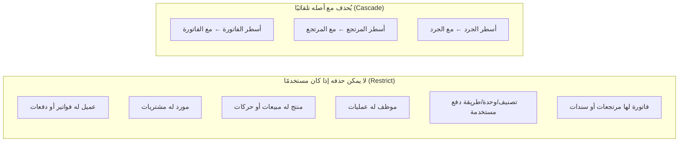

# المرحلة 3: العلاقات

> الحالة: **مكتملة وبانتظار موافقتك** قبل المرحلة 4 (الاستعلامات).

## 1. ما الذي تم إنشاؤه

| الملف | الغرض |
|---|---|
| [`dist/vba/modBuildRelations.bas`](../dist/vba/modBuildRelations.bas) | **الملف الذي تستورده في Access** |
| [`src/vba/modBuildRelations.bas`](../src/vba/modBuildRelations.bas) | نفس الكود بترميز UTF-8 للقراءة |
| [`docs/03-Relationships-Reference.md`](03-Relationships-Reference.md) | **مخطط ERD كامل + جدول العلاقات الـ 51** |
| `tools/relations.py` | يستخرج العلاقات من تعريف الجداول، ويعرّف سيناريو الاختبار |
| `tests/test_relations.py` | 22 اختبارًا آليًا، منها تشغيل نفس سيناريو Access على قاعدة SQLite |

**51 علاقة، وكلها تفرض التكامل المرجعي (Enforce Referential Integrity).**

| نوع القاعدة | العدد | أين |
|---|---|---|
| **تقييد (Restrict)** | 43 | الافتراضي: لا يمكن حذف سجل أصلي له سجلات مرتبطة |
| **حذف متتالٍ (Cascade Delete)** | 7 | من رأس المستند إلى أسطره فقط: فاتورة البيع، مرتجع البيع، فاتورة الشراء، مرتجع الشراء، الجرد. وكذلك من الدور والصلاحية إلى `RolePermissions` |
| **تحديث متتالٍ (Cascade Update)** | 1 | `Permissions.PermissionKey` ← `RolePermissions` (المفتاح الوحيد النصي القابل للتغيير؛ مفاتيح AutoNumber لا تتغير أبدًا) |

---

## 2. قواعد الحذف بشكل مبسّط



**المعنى العملي للمستخدم:**
- لا يمكن أن توجد فاتورة لعميل محذوف، ولا سطر لمنتج غير موجود، ولا حركة مخزون "يتيمة".
- لإيقاف عميل أو منتج أو موظف قديم: **عطّله** (`IsActive = لا`) ولا تحذفه، فيبقى تاريخه في التقارير.
- **الفاتورة التي لها مرتجع لا يمكن حذفها** حتى بالحذف المتتالي، لأن أسطر المرتجع تشير إلى أسطرها. (هذا مقصود ومُختبَر.)
- الحذف المتتالي موجود للحالات الإدارية فقط. النماذج (المرحلة 5) **لن تعرض زر حذف للفواتير المحفوظة**.

---

## 3. طريقة التشغيل

> المتطلب: أن تكون المرحلة 2 قد نُفّذت (`BuildSchema` نجح).

1. افتح `RetailStore_FE.accdb`، و**أغلق أي جدول أو نموذج مفتوح**.
2. اضغط **Alt + F11** ← **File ← Import File...** ← اختر `dist/vba/modBuildRelations.bas`.
3. في نافذة **Immediate** (اضغط **Ctrl + G**) اكتب:
   ```
   BuildRelationships
   ```
4. **النتيجة المتوقعة:** رسالة "تم إنشاء العلاقات بنجاح – علاقات جديدة: 51".
5. احفظ (**Ctrl + S**).

> **إذا كانت هناك بيانات قديمة لا تتوافق مع العلاقات:** يتخطى `BuildRelationships` العلاقة المتأثرة، ويكتب في الرسالة كم سجلًا يتيمًا وفي أي جدول (مثال: "يوجد 3 سجل في SalesInvoices.CustomerID يشير إلى سجل غير موجود في Customers"). أصلح السجلات أو احذفها، ثم أعد تشغيل الأمر؛ العلاقات التي أُنشئت سابقًا لن تتكرر.

### عرض مخطط العلاقات داخل Access
العلاقات محفوظة في ملف البيانات، لذلك:
1. افتح الملف `RetailStore_BE.accdb`.
2. **Database Tools ← Relationships**.
3. من شريط **Relationship Design** اضغط **All Relationships**.
4. ستظهر الجداول الـ 29 والخطوط بينها. رتّبها بالسحب، ثم احفظ التخطيط (**Ctrl + S**).

(Access لا يتيح ترتيب هذه النافذة برمجيًا، لذلك يكون الترتيب الأول يدويًا مرة واحدة. المخطط المرتب جاهز أيضًا في [مرجع العلاقات](03-Relationships-Reference.md).)

---

## 4. طريقة الاختبار

### 4.1 الاختبار الآلي داخل Access
في نافذة Immediate اكتب:
```
TestRelationships
```
يعمل الاختبار **داخل معاملة يتم التراجع عنها بالكامل**، فلا تبقى أي بيانات اختبار في قاعدتك.

**النتيجة المتوقعة:** "جميع اختبارات العلاقات ناجحة (71 اختبارًا)". ما الذي يُفحص:

| # | المجموعة | العدد | التفاصيل |
|---|---|---|---|
| 1 | وجود العلاقات | 52 | كل علاقة الـ 51 موجودة، تربط الجداول والحقول الصحيحة، تفرض التكامل، وخيارات Cascade صحيحة. يُضاف اختبار للعدد الكلي |
| 2 | رفض السجلات اليتيمة | 12 | فاتورة لعميل غير موجود، فاتورة بموظف غير موجود، سطر لفاتورة غير موجودة، شراء من مورد غير موجود، منتج بتصنيف أو مورد غير موجود، حركة مخزون لمنتج غير موجود، سند قبض أو صرف لطرف غير موجود، مصروف بنوع غير موجود، مستخدم بدور غير موجود، صلاحية غير معرّفة |
| 3 | منع حذف بيانات مستخدمة | 5 | دور له مستخدمون، العميل النقدي، تصنيف عليه منتجات، موظف له فواتير، منتج له مبيعات |
| 4 | الحذف المتتالي | 1 | حذف فاتورة تجريبية بسطرين ← السطران يُحذفان تلقائيًا |
| 5 | التحديث المتتالي | 1 | تغيير رمز صلاحية ← يتغير في كل الأدوار التي تملكها |

تفاصيل كل اختبار تظهر في نافذة Immediate بعلامة `[OK]` أو `[X]`.

### 4.2 اختبار يدوي (اختياري، دقيقتان)
| # | الخطوات | النتيجة المتوقعة |
|---|---|---|
| 1 | افتح جدول `SalesInvoices` وأضف سجلًا: `InvoiceNumber = T1`، `CustomerID = 500`، `EmployeeID = 1` | رسالة Access: *"You cannot add or change a record because a related record is required in table 'Customers'"* |
| 2 | افتح `Categories` وحاول حذف التصنيف "عام" بعد إضافة منتج عليه | رسالة: *"The record cannot be deleted or changed because table 'Products' includes related records"* |
| 3 | افتح `Customers` وحاول حذف "عميل نقدي" | رسالة مشابهة (مرتبط بجدول `Settings`) |

### 4.3 الاختبارات الآلية في المستودع (للمطوّر)
```
python3 tools/generate.py
python3 -m unittest discover -s tests -v      # 46 اختبارًا (المرحلتان 2 و 3)
```
- السيناريو الذي يشغّله `TestRelationships` في Access يُشغَّل هنا بنفس جمل SQL حرفيًا على نسخة SQLite من القاعدة، بنفس قواعد الحذف والتحديث.
- اختبار إضافي يثبت أن **الفاتورة التي لها مرتجع لا يمكن حذفها**.
- فحوص جديدة للكود المولَّد: كل متغير مُعرَّف (`Option Explicit`)، وتوازن كتل `If` متعددة الأسطر.

---

## 5. المشكلات التي اكتُشفت وأُصلحت في هذه المرحلة

| # | المشكلة | الأثر | الإصلاح |
|---|---|---|---|
| 1 | `Settings.DefaultCustomerID` لم يكن مرتبطًا بجدول العملاء | يمكن ضبط العميل الافتراضي على رقم غير موجود فتتعطل نقطة البيع | أصبح علاقة رقم 51، ويمنع حذف "عميل نقدي" |
| 2 | اختبارات منع الحذف كانت ستفشل على قاعدة جديدة لأنها فارغة؛ مثلًا حذف التصنيف "عام" ينجح فعلًا إذا لم يكن عليه أي منتج | نتيجة اختبار خاطئة | تُنفَّذ اختبارات الحذف بعد إنشاء منتج وفاتورة تجريبيين داخل المعاملة |
| 3 | علاقة رسمها المستخدم يدويًا بنفس الحقول وباسم مختلف قد تسبب علاقة مكررة | تكرار أو خطأ عند الإنشاء | `BuildRelationships` يكتشف العلاقة المرسومة يدويًا ويتخطاها، ويذكر اسمها |
| 4 | بيانات قديمة يتيمة تُفشل إنشاء العلاقة برسالة Access عامة وغير واضحة | صعوبة معرفة السبب | قبل كل علاقة تُعدّ السجلات اليتيمة وتظهر رسالة عربية تحدد الجدول والحقل والعدد |
| 5 | فشل علاقة واحدة كان سيوقف بناء الباقي | بناء ناقص | لكل علاقة معالج أخطاء مستقل، والتقرير النهائي يجمع كل ما فشل |
| 6 | المولّد يتحقق من عدم بقاء رموز قالب (`@@...@@`) لكنه اشتبه خطأً بـ `@@IDENTITY` (وهو أمر SQL صحيح في Access) | توقف التوليد | الفحص يطابق صيغة الرموز فقط |
| 7 | اختبار توازن الكتل كان يحسب `If` متعدد الأسطر خطأً | الاختبار لا يعكس الكود الحقيقي | تُدمج الأسطر المتصلة بـ ` _` قبل الفحص |

### قيود معروفة (تُعالج في مراحل لاحقة)
العلاقات تضمن أن كل رقم يشير إلى سجل **موجود**، لكنها لا تضمن **الاتساق بين جدولين**. أمثلة:
- أن يكون عميل المرتجع هو نفسه عميل الفاتورة الأصلية.
- أن يكون سطر المرتجع من نفس الفاتورة التي يشير إليها رأس المرتجع.
- أن يكون منتج سطر المرتجع هو منتج السطر الأصلي.

Access لا يدعم هذا النوع من القيود على مستوى الجدول. الحل:
1. **المرحلة 6:** كود الحفظ يملأ هذه الحقول تلقائيًا من الفاتورة الأصلية، فلا يدخلها المستخدم أصلًا.
2. **المرحلة 4:** استعلام فحص سلامة `IntegrityCheckQuery` يكشف أي تعارض من هذا النوع، ويُعرض في لوحة المدير.

---

## 6. المرحلة التالية

**المرحلة 4: الاستعلامات**، وتشمل:
- الاستعلامات التسعة المطلوبة في البرومبت: `DailySalesQuery`، `MonthlySalesQuery`، `StockBalanceQuery`، `LowStockQuery`، `CustomerBalanceQuery`، `SupplierBalanceQuery`، `ProfitQuery`، `BestSellingProductsQuery`، `SlowMovingProductsQuery`.
- استعلامات التقارير الـ 16، وكشوف الحساب بالرصيد التراكمي، وملخص ضريبة القيمة المضافة، واستعلامات فحص السلامة.
- اختبار **الأرقام** في كل استعلام على بيانات معروفة النتيجة مسبقًا. مثال: شراء 100 قطعة وبيع 10، فيجب أن يظهر في المخزون 90 بالضبط.
