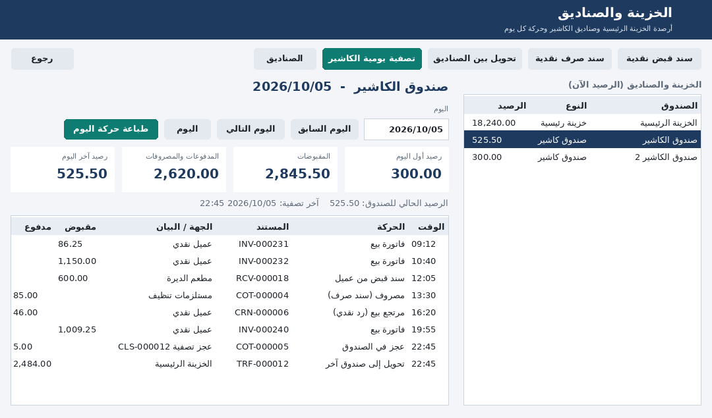
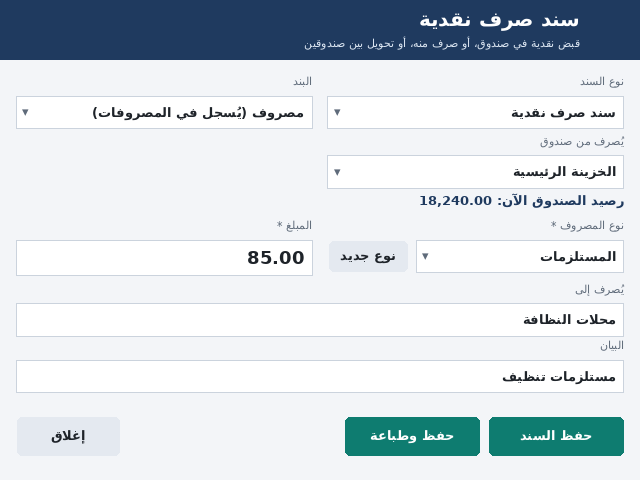
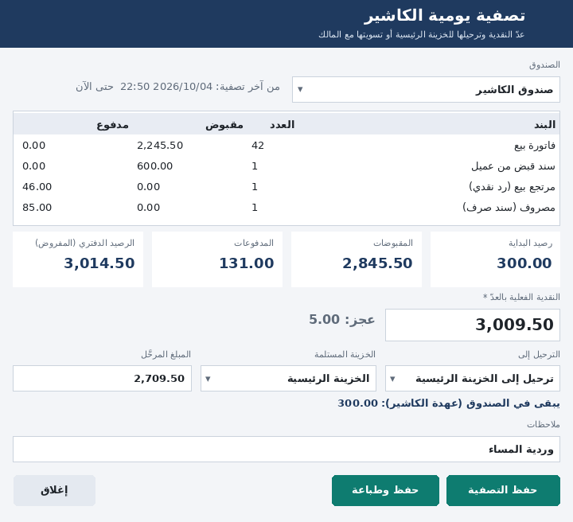

# الخزينة والصناديق وتقارير المصروفات

## الفكرة
- يوجد في البرنامج **خزينة رئيسية** و**صناديق كاشير**، ويمكن إضافة صناديق أخرى من شاشة **الصناديق**.
- **الرصيد لا يُكتب يدويًا أبدًا.** يحسبه البرنامج في كل لحظة من الحركات النقدية، وهي:

| الحركة | تزيد الصندوق | تنقص الصندوق |
|---|---|---|
| فاتورة بيع (المبلغ المدفوع نقدًا) | ✅ | |
| مرتجع بيع برد نقدي | | ✅ |
| سند قبض من عميل (نقدي) | ✅ | |
| فاتورة شراء (المدفوع نقدًا) | | ✅ |
| مرتجع شراء باسترداد نقدي | ✅ | |
| سند صرف لمورد (نقدي) | | ✅ |
| مصروف مدفوع نقدًا | | ✅ |
| **سند قبض نقدية** (إيداع من المالك، إيرادات أخرى) | ✅ | |
| **سند صرف نقدية** (مصروف، تسوية مع المالك، سلفة، أخرى) | | ✅ |
| **تحويل بين الصناديق** | الصندوق المستلم | الصندوق المحوِّل |
| عجز أو زيادة عند تصفية الكاشير | الزيادة | العجز |

- الدفع بالبطاقة (مدى) أو بالتحويل البنكي **لا يدخل أي صندوق**.
- البيع الآجل لا يدخل الصندوق إلا ما دُفع منه نقدًا.

## أي صندوق؟
- **حقل «صندوق النقدية» في شاشة المستخدمين:** كل عملية نقدية للمستخدم تذهب إلى الصندوق المحدد له.
- **إذا لم يُحدَّد له صندوق:**
  - من لديه صلاحية **«الخزينة»** (مدير النظام والمدير) تذهب عملياته إلى **الخزينة الرئيسية**.
  - الكاشير تذهب عملياته إلى **أول صندوق كاشير نشط**.
- **عند وجود أكثر من كاشير**، أنشئ صندوقًا لكل كاشير، واختره له في شاشة المستخدمين.

## الشاشات
> الصور تقريبية مرسومة من تصميم الشاشات ببيانات مثال، وليست لقطات من Access.

### الخزينة (`frmTreasury`)
تفتح من القائمة الجانبية أو من مربع **الخزينة** في الشاشة الرئيسية.
- **يمينًا:** كل الصناديق وأرصدتها الآن.
- **يسارًا:** يوم الصندوق المختار، بأربعة أرقام:
  - **رصيد أول اليوم**
  - **المقبوضات**
  - **المدفوعات والمصروفات**
  - **رصيد آخر اليوم**
- **تحت الأرقام:** كل حركة في اليوم، بوقتها ونوعها ورقم المستند والجهة.
- **التنقل بين الأيام:** «اليوم السابق» و«اليوم التالي» و«اليوم».
- **«طباعة حركة اليوم»:** تطبع تقرير اليوم.
- **الأزرار:** سند قبض نقدية، سند صرف نقدية، تحويل بين الصناديق، تصفية يومية الكاشير، الصناديق.

### سند النقدية (`frmCashVoucher`)
**نوع السند** واحد من ثلاثة: قبض، أو صرف، أو تحويل.

| النوع | البنود |
|---|---|
| **سند قبض نقدية** | قبض نقدية (إيرادات أخرى)، أو إيداع من المالك |
| **سند صرف نقدية** | **مصروف** (اختر نوعه، ويمكن إضافة نوع جديد بزر **«نوع جديد»**)، أو تسوية / مسحوبات المالك، أو سلفة موظف، أو صرف آخر |
| **تحويل بين الصناديق** | من صندوق إلى صندوق آخر |

- **الصرف يُخصم من رصيد الصندوق المختار.** البرنامج **يرفض الصرف أو التحويل** إذا كان المبلغ أكبر من الرصيد.
- **صرف بند «مصروف»** يسجل المصروف تلقائيًا في **المصروفات**، فيظهر في تقارير المصروفات وصافي الربح. يحمل المصروف رقم السند في وصفه.
  - هذا المصروف **لا يُعدَّل** من شاشة المصروفات.
  - للتصحيح: سند قبض بالمبلغ، ثم سند صرف جديد.

### تصفية يومية الكاشير (`frmCashClosing`)
1. اختر الصندوق. الكاشير يرى صندوقه فقط.
2. تظهر الحركات منذ **آخر تصفية**، مجمّعة حسب البند، ثم أربعة أرقام: **رصيد البداية**، و**المقبوضات**، و**المدفوعات**، و**الرصيد الدفتري (المفروض)**.
3. اكتب **النقدية الفعلية بالعدّ**. يظهر **العجز** أو **الزيادة** أو «مطابق».
4. اختر **الترحيل إلى**:

   | الاختيار | ماذا يحدث |
   |---|---|
   | **الخزينة الرئيسية** | يُسجَّل سند تحويل إلى الخزينة المختارة |
   | **تسليم للمالك (تسوية)** | يُسجَّل سند صرف ببند «تسوية مع المالك» |
   | **يبقى في الصندوق** | لا يُرحَّل شيء |

5. **المبلغ المرحَّل:** يُقترح كل المعدود تلقائيًا. اكتب أقل منه إذا أردت إبقاء **عهدة** (فكة) للوردية التالية.
6. **حفظ التصفية**، أو **حفظ وطباعة** لطباعة ورقة التصفية بتوقيع الكاشير والمستلم.

**ماذا يُسجَّل عند الحفظ:** سند عجز أو زيادة يجعل الصندوق مطابقًا للعدّ، ثم سند الترحيل. لا يمكن تعديل التصفية بعد حفظها.

### المصروفات
- **الحقول الجديدة في شاشة المصروفات:**
  - زر **«نوع جديد»** بجانب نوع المصروف، يضيف النوع إلى القائمة ويختاره مباشرة.
  - زر **«أنواع المصروفات»** لإدارة القائمة كاملة.
  - حقل **«صُرف من صندوق»**.
- **عند اختيار طريقة الدفع «نقدي»** يُختار صندوقك تلقائيًا، ويُخصم المصروف منه.

### الصناديق (`frmCashBoxes`)
- **الحقول:** اسم الصندوق، والنوع (خزينة رئيسية أو صندوق كاشير)، و**الرصيد الافتتاحي** وتاريخه، وهو النقدية الموجودة عند بدء الاستخدام.
- **الحذف:** الصندوق الذي عليه حركات لا يُحذف، بل يُلغى تنشيطه.

## التقارير (مركز التقارير)
| التقرير | الاختيارات | المحتوى |
|---|---|---|
| **المصروفات (تفصيلي)** | الفترة، ونوع المصروف (اختياري) | كل مصروف بتاريخه ونوعه ووصفه والمبلغ والضريبة والإجمالي |
| **المصروفات (إجمالي حسب النوع)** | الفترة | لكل نوع: العدد والمبلغ والضريبة والإجمالي |
| **حركة الخزينة / الصندوق (تفصيلي)** | الفترة، والصندوق (فارغ = كل الصناديق) | رصيد أول المدة، ثم كل حركة بمقبوضها ومدفوعها والرصيد بعدها. في آخره: رصيد أول المدة، والمقبوضات، والمدفوعات، ورصيد آخر المدة |
| **حركة الخزينة اليومية** | الفترة، والصندوق | لكل يوم: **رصيد أول اليوم، والمقبوضات، والمدفوعات، ورصيد آخر اليوم** |
| **أرصدة الخزينة والصناديق** | — | رصيد كل صندوق الآن، وإجمالي الداخل والخارج، وآخر حركة |
| **تصفيات يومية الكاشير** | الفترة، والصندوق | كل تصفية: الدفتري، والفعلي، والعجز أو الزيادة، والمرحَّل وجهته، والمتبقي |

تقارير الخزينة تحتاج صلاحية **«الخزينة»**.

## الصلاحيات
| الصلاحية | مدير النظام | المدير | الكاشير |
|---|---|---|---|
| **الخزينة**: سندات القبض والصرف والتحويل، والصناديق، وتقارير الخزينة | ✅ | ✅ | ❌ |
| **تصفية يومية الكاشير** (الكاشير يصفّي صندوقه فقط) | ✅ | ✅ | ✅ |

## الجداول والحقول الجديدة (يضيفها `BuildSchema` لقاعدتك الحالية)
- **جداول جديدة:**
  - `CashBoxes`: الصناديق، وفيها صندوقان جاهزان: «الخزينة الرئيسية» و«صندوق الكاشير».
  - `CashVouchers`: سندات النقدية.
  - `CashClosings`: تصفيات الكاشير.
- **حقل `CashBoxID`** في: المستخدمين، وفواتير ومرتجعات البيع والشراء، وسندات القبض والصرف، والمصروفات.
- **عدّادات جديدة:** `CIN-`، `COT-`، `TRF-`، `CLS-`.
- **صلاحيتان جديدتان:** «الخزينة» و«تصفية يومية الكاشير». تضيفهما `BuildSchema` لقاعدتك الحالية وتمنحهما للأدوار الافتراضية، ولا تغيّر أي صلاحية عدّلتها أنت.
- **البيانات السابقة:** المستندات المسجلة قبل هذا التحديث **لا تدخل الصناديق**، لأنه لا يُعرف من أي صندوق دُفعت. اكتب **الرصيد الافتتاحي** لكل صندوق بالنقدية الموجودة فيه يوم بدء الاستخدام.

## التثبيت
| # | الخطوة |
|---|---|
| 1 | **نسخة احتياطية** |
| 2 | استورد الوحدة الجديدة **`modCash`** |
| 3 | استبدل: `modBuildSchema`، `modBuildRelations`، `modBuildQueries`، `modBuildForms`، `modBuildReports`، `modSales`، `modPurchases`، `modForms`، `modScreens`، `modQueryParams`، `modAppData`، `modDemoData`، `modTestAll` |
| 4 | **Debug ← Compile** |
| 5 | `BuildSchema` ← `BuildRelations` ← `BuildQueries` ← `BuildForms` ← `BuildReports` ← `RunAllTests` |
| 6 | **الصناديق:** اكتب الرصيد الافتتاحي لكل صندوق. **المستخدمون:** اختر صندوق كل كاشير |

## كيف تحققتُ
| الاختبار | النتيجة |
|---|---|
| استعلامات الخزينة على قاعدة اختبار: رصيد كل صندوق، ورصيد أول المدة، والحركات، ورصيد أول اليوم وآخره يوم التصفية، والتصفيات، وطباعة السندات | ✅ |
| سيناريو كامل بقواعد الترحيل نفسها: إيداع المالك، وشراء نقدي، ومبيعات الكاشير، ومصروف نقدي، ومصروف بتحويل لا يدخل الصندوق، وتصفيتان (عجز 5 ثم زيادة 5) بترحيل للخزينة ثم للمالك. الأرصدة والتقارير متطابقة | ✅ |
| كل مستند نقدي (بيع، مرتجع، قبض، شراء، مرتجع شراء، صرف لمورد) يملأ صندوقه، وكود التصفية يطابق القواعد المختبرة | ✅ |
| `TestCash` داخل Access: قبض، وصرف مصروف يسجل مصروفًا، ورفض الصرف فوق الرصيد، ورفض التحويل لنفس الصندوق، وتحويل، وتصفية بعجز وترحيل. كل ذلك داخل معاملة تُلغى | ✅ |
| البيانات التجريبية: إيداع المالك، ومسحوبات، وتصفيتان. `VerifyDemoData` يطابق رصيد الخزينة وصندوق الكاشير | ✅ |
| عناصر الشاشات التي يستخدمها الكود موجودة، والشاشات تتسع لشاشة لابتوب | ✅ |
| **لم يُختبر بعد** | التشغيل الفعلي في Access والطباعة على طابعة |
