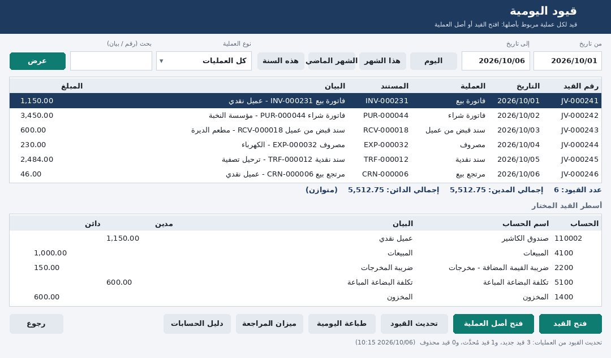

# قيود اليومية ودليل الحسابات

## الفكرة
- **لكل عملية قيد آلي واحد**، مربوط بأصله عن طريق نوع العملية ورقمها (`SourceType` + `SourceID`).
- **من شاشة المراجعة** تفتح القيد نفسه، أو تفتح **أصل العملية**: الفاتورة، أو السند، أو المصروف.
- **القيود لا تُكتب يدويًا.** تُنشأ وتُحدَّث من العمليات:

| الحالة | ماذا يحدث للقيد |
|---|---|
| عملية جديدة | يُنشأ لها قيد جديد. **أرقام القيود الجديدة بترتيب تاريخ العمليات** (JV-000001…) |
| عملية تغيرت (مثل تعديل مبلغ مصروف أو نوعه) | **يُعاد بناء قيدها بنفس رقمه**، ويُسجَّل وقت التحديث |
| عملية حُذفت (مصروف محذوف) | يُحذف قيدها |
| عملية غير متوازنة (خطأ في البيانات) | لا يُنشأ لها قيد، ويظهر تنبيه باسمها لمراجعتها |

- **متى يتم التحديث:**
  - عند فتح شاشة **قيود اليومية**.
  - بزر **«تحديث القيود»**.
  - قبل طباعة تقريري اليومية وميزان المراجعة.
- **التحديث آمن:**
  - يتم في معاملة واحدة.
  - تشغيله مرة ثانية لا يغيّر شيئًا.
  - قيود البيانات الموجودة تُنشأ كلها من أول مرة.

## القيود
**الأسعار شاملة الضريبة:** المبيعات = الصافي بدون ضريبة، والضريبة في حسابها.

| العملية | مدين | دائن |
|---|---|---|
| **فاتورة بيع** | الصندوق أو البنك (المدفوع)، وذمم العملاء (المتبقي)، وتكلفة البضاعة المباعة | المبيعات (بدون ضريبة)، وضريبة المخرجات، والمخزون (بالتكلفة) |
| **مرتجع بيع** | مردودات المبيعات، وضريبة المخرجات، والمخزون (ما عاد للمخزون بتكلفته) | الصندوق أو البنك (المردود)، وذمم العملاء، وتكلفة البضاعة المباعة |
| **فاتورة شراء** | المخزون (بدون ضريبة)، وضريبة المدخلات | الصندوق أو البنك (المدفوع)، وذمم الموردين (المتبقي) |
| **مرتجع شراء** | الصندوق أو البنك (المسترد)، وذمم الموردين | المخزون، وضريبة المدخلات |
| **سند قبض من عميل** | الصندوق أو البنك | ذمم العملاء |
| **سند صرف لمورد** | ذمم الموردين | الصندوق أو البنك |
| **مصروف** | حساب نوع المصروف، وضريبة المدخلات | الصندوق أو البنك |
| **سند قبض نقدية** | الصندوق | جاري المالك (إيداع)، أو إيرادات أخرى، أو زيادة الصناديق |
| **سند صرف نقدية** | جاري المالك (تسوية)، أو نوع المصروف، أو سلف الموظفين، أو عجز الصناديق، أو مصروفات أخرى | الصندوق |
| **تحويل بين الصناديق** | الصندوق المستلم | الصندوق المحوِّل |
| **حركة مخزون يدوية / تسوية جرد** | المخزون (الزيادة) أو فروقات المخزون (النقص) | العكس |
| **رصيد مخزون افتتاحي** | المخزون | أرصدة افتتاحية |
| **رصيد افتتاحي لصندوق أو عميل أو مورد** | الصندوق / ذمم العملاء (أو أرصدة افتتاحية للمورد) | أرصدة افتتاحية (أو ذمم الموردين) |

**أي حساب نقدية؟**

| الحالة | الحساب |
|---|---|
| المستند له صندوق | حساب ذلك الصندوق |
| الدفع بالبطاقة أو التحويل | **البنك والشبكة 1200** |
| دفع نقدي قديم بدون صندوق (قبل تفعيل الخزينة) | **نقدية غير موزعة على صندوق 1190** |

**مصروف سجّله سند صرف نقدية:** يُقيَّد مرة واحدة فقط، بقيد السند.

## دليل الحسابات
| الرقم | الحساب | الرقم | الحساب |
|---|---|---|---|
| 1100 | النقدية بالخزينة والصناديق (رئيسي) | 2100 | ذمم الموردين |
| **110000 + رقم الصندوق** | حساب لكل صندوق (يُنشأ تلقائيًا) | 2200 | ضريبة القيمة المضافة - مخرجات |
| 1190 | نقدية غير موزعة على صندوق | 3100 | جاري المالك |
| 1200 | البنك والشبكة | 3900 | أرصدة افتتاحية |
| 1300 | ذمم العملاء | 4100 / 4110 | المبيعات / مردودات المبيعات |
| 1400 | المخزون | 4200 / 4300 | إيرادات أخرى / زيادة الصناديق |
| 1500 | ضريبة القيمة المضافة - مدخلات | 5100 | تكلفة البضاعة المباعة |
| 1600 | سلف الموظفين | 5200 | فروقات وتسويات المخزون |
| | | 5300 + **530000 + رقم النوع** | المصروفات التشغيلية: حساب لكل نوع مصروف (يُنشأ تلقائيًا) |
| | | 5400 / 5900 | عجز الصناديق / مصروفات أخرى |

- **التعديل:** يمكن تعديل أسماء الحسابات من شاشة **دليل الحسابات**.
- **الأرقام لا تتغير:** قواعد القيود تستخدمها.

## الشاشات
### قيود اليومية (`frmJournal`)
- **أعلى الشاشة:** الفترة (اليوم، هذا الشهر، الشهر الماضي، هذه السنة)، ونوع العملية، والبحث برقم القيد أو المستند أو البيان.
- **القائمة الأولى:** القيود برقمها وتاريخها ونوع العملية ورقم المستند والبيان والمبلغ.
- **سطر الإجماليات:** عدد القيود، وإجمالي المدين والدائن، و«متوازن».
- **القائمة الثانية:** أسطر القيد المختار، بالحساب والبيان والمدين والدائن.
- **فتح القيد:** بزر **فتح القيد**، أو بنقر مزدوج على القيد.
- **فتح أصل العملية:**

  | العملية | ماذا يُفتح |
  |---|---|
  | فاتورة البيع والشراء | شاشة عرض الفاتورة |
  | المصروف، والصندوق، والعميل، والمورد | السجل نفسه في شاشته |
  | المرتجعات، والسندات، والجرد | المستند للمعاينة والطباعة |
  | حركة المخزون اليدوية | شاشة المخزون |

- **أزرار أخرى:** **تحديث القيود**، و**طباعة اليومية**، و**ميزان المراجعة**، و**دليل الحسابات**.

> الصورة تقريبية مرسومة من تصميم الشاشة ببيانات مثال.

### القيد (`frmJournalEntry`)
- **المحتوى:** رقم القيد وتاريخه، والعملية ورقم مستندها، والبيان، والأسطر، والإجمالي.
- **الأزرار:** **فتح أصل العملية**، و**طباعة القيد** على A4 بتوقيع المحاسب والمراجع والمدير.

## التقارير (مركز التقارير)
| التقرير | المحتوى |
|---|---|
| **قيود اليومية** | كل قيود الفترة بأسطرها، وإجمالي المدين والدائن |
| **ميزان المراجعة** | لكل حساب: رصيد أول المدة، ومدين ودائن الفترة، والرصيد الختامي. المدين موجب والدائن سالب، ومجموع الأرصدة صفر |

## الصلاحية
- **صلاحية جديدة:** «قيود اليومية ودليل الحسابات وميزان المراجعة».
- **من يملكها:** مدير النظام والمدير.
- **في قاعدتك الحالية:** تضيفها `BuildSchema` وتمنحها لهذين الدورين.

## الجداول الجديدة (يضيفها `BuildSchema`)
| الجدول | المحتوى |
|---|---|
| `Accounts` | دليل الحسابات |
| `JournalSourceTypes` | أنواع العمليات |
| `JournalEntries` | رأس القيد: الرقم والتاريخ ونوع العملية ورقمها والإجماليات. **قيد واحد لكل عملية** (فهرس فريد)، و**المدين = الدائن** (قاعدة تحقق) |
| `JournalLines` | أسطر القيد: الحساب والمدين والدائن والبيان |

## التثبيت
| # | الخطوة |
|---|---|
| 1 | **نسخة احتياطية** |
| 2 | استورد الوحدة الجديدة **`modJournal`** |
| 3 | استبدل: `modBuildSchema`، `modBuildRelations`، `modBuildQueries`، `modBuildForms`، `modBuildReports`، `modScreens`، `modAppData`، `modDemoData`، `modTestAll` |
| 4 | **Debug ← Compile** |
| 5 | `BuildSchema` ← `BuildRelations` ← `BuildQueries` ← `BuildForms` ← `BuildReports` |
| 6 | افتح **قيود اليومية** من القائمة الجانبية، فتُنشأ قيود كل العمليات الموجودة. ثم شغّل `RunAllTests` |

## كيف تحققتُ
| الاختبار | النتيجة |
|---|---|
| قواعد القيود على بيانات الاختبار، وكل قيد متوازن | ✅ |
| حساب ذمم العملاء = أرصدة العملاء (164) | ✅ |
| حساب ذمم الموردين = رصيد المورد (2855 دائن) | ✅ |
| حساب المخزون = قيمة المخزون بالتكلفة (7040) | ✅ |
| حساب كل صندوق = رصيده | ✅ |
| ضريبة المخرجات من القيود صحيحة | ✅ |
| مصروف سند النقدية لا يُقيَّد مرتين | ✅ |
| التحديث بنفس خطوات `SyncJournal`: قيد لكل عملية، والأرقام بترتيب التاريخ، والتحديث الثاني لا يغيّر شيئًا | ✅ |
| تغيير نوع مصروف يعيد بناء قيده بنفس الرقم، وحذفه يحذف قيده، والجديد يأخذ الرقم التالي | ✅ |
| ميزان المراجعة: مجموع الأرصدة صفر، وأرصدة أول المدة صحيحة | ✅ |
| البيانات التجريبية: 35 قيدًا متوازنًا، وحساب المخزون = قيمة المخزون | ✅ |
| `TestJournal` داخل Access: التحديث، والتوازن، وقيد لكل فاتورة، وتطابق العملاء والموردين، وقيد مصروف جديد ثم معدل ثم محذوف (داخل معاملة تُلغى) | ✅ |
| **لم يُختبر بعد** | التشغيل الفعلي في Access، ووقت أول تحديث على قاعدة كبيرة |

**تنبيه عن حساب المخزون:**
- **قد لا يطابق قيمة المخزون بالضبط**، فيظهر فرق صغير.
- **السبب:**
  - المشتريات تُقيَّد بسعر الفاتورة.
  - المبيعات تُقيَّد بمتوسط التكلفة.
  - مرتجع الشراء يُقيَّد بسعر الفاتورة الأصلية.
- **في بيانات الاختبار والبيانات التجريبية تطابقا تمامًا.**
